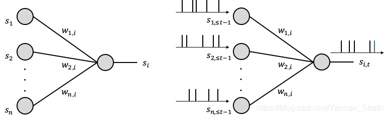
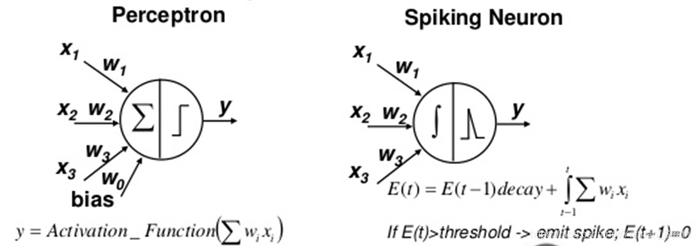
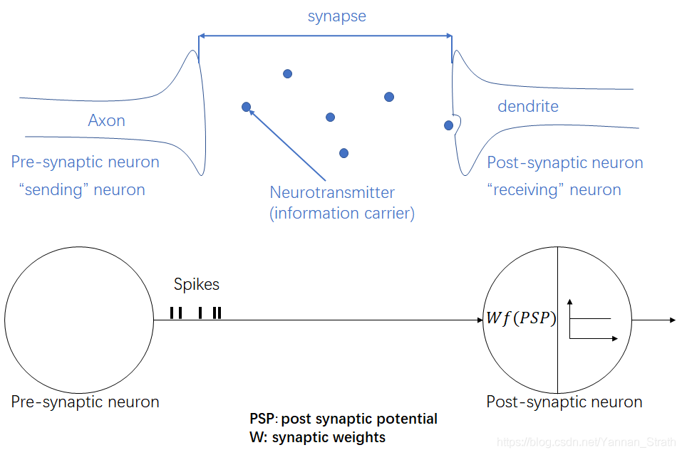
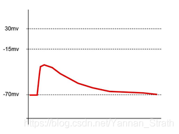
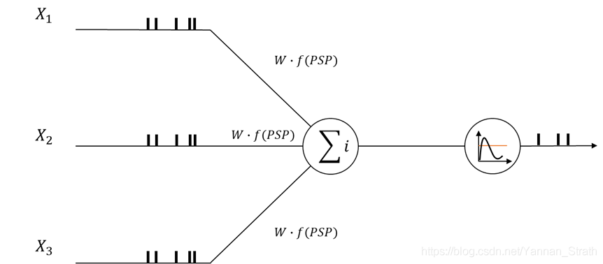
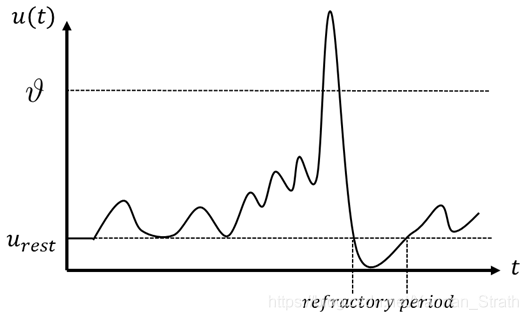
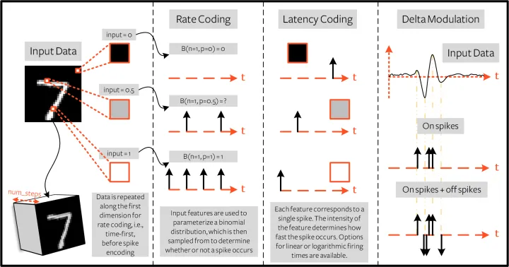
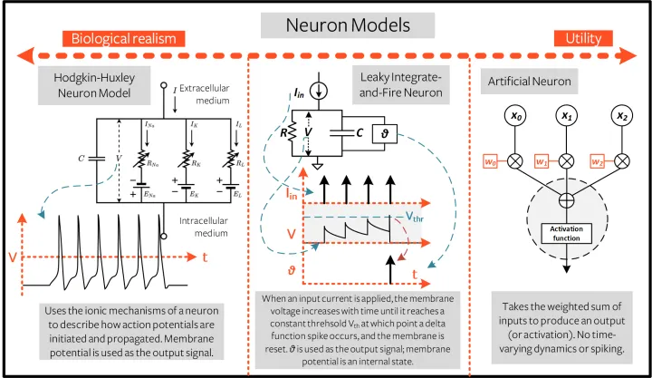

# SNN 学习笔记

## SNN 和 ANN 的区别 ^[https://blog.csdn.net/Yannan_Strath/article/details/105761023]

### 信息载体 information carrier

ANN 使用的是高精度浮点数而 SNN 使用的是 spikes 或可以理解为 1 和 0,这增加了信息在网络中的稀疏性.这些 spike 在网络中有相同的幅度和 duration.


### 神经元模型

  
**左: 传统神经元 右: spiking neuron**

ANN 基本神经元是一个加乘运算器用来整合输入该神经元的值 而后接着一个非线性的激活函数, 这种针对确切数值的运算并不适用于二进制脉冲的处理.

**spiking neuron 的示例, PSP 代表 post synaptic potential. :**


那么 PSP 是什么呢? 简单的解释就是神经元上的膜电压变化.例如图三就是一个神经元接受到 spike 后膜电压 u(t) 随着时间 t 的变化.在生物学中, 这种电脉冲的幅值和时间常数是在特定范围内的, 例如图三中, 膜电压在接受到脉冲输入前会一直保持在 -70mV 的地方, 这个值通常叫做静止值(resting value). 当接受到刺激后, 会产生电压变化的幅值. 在变化结束后, 膜电压会归位回起始的静止值.在实际操作中这种波形要怎样产生呢? 科学家们对生物神经元进行实验分析后, 给出了许多神经元的微分方程模型:

比如 **IF neuron**:
$
    I(t) = C_m \frac{dV_m(t)}{dt}
$
可以看出来式子为电容定律的时间导数,$Q = CV$. 当施加输入电流时,膜电压会随时间增加,直到达到恒定阈值 Vth,此时将出现增量函数尖峰,并且电压会重置为其静止电位,此后模型将继续运行.

除此之外还有 `Hodgkin–Huxley`, `LIF`, `SRM` 等, 但 Neuron model 在 SNN 中的作用主要还是作为脉冲序列的处理单元
**单个 spike 产生的膜电压变化:**


**单个 spiking neuron 接受多个 spike 输入:**
  


突触后神经元会首先按照接受到的时间整合脉冲, 将他们变为膜电压的变化的叠加. 当膜电压超过预先设置好的阈值($\vartheta$)时,突触后 neuron 被认定为收到了足够的刺激从而发出一个脉冲. 发出脉冲后, 膜电压会被重置并且突触后神经元会在一段时间内无法处理接收到的脉冲, 这段时间称为神经元的 refractory period. 在 refractory period 之后, 膜电压会恢复到静止值从而可以准备下一次脉冲的产生. 这就是脉冲神经元一次完整的 spike generation 过程

## SNN 的学习方法 ^[https://zhuanlan.zhihu.com/p/35796933]

-   梯度下降学习算法: `SpikeProp`, `Slayer` 等
-   突触可塑性学习算法
-   脉冲序列卷积学习算法

尽管 SNN 的各种监督学习算法有差异, 但是目标总体一致:
对于给定的多个输入卖葱序列$S_i(t)$和多个目标脉冲序列$S_d(t)$, 寻找 SNN 合适的突触权重$W$, 使神经元的输出脉冲序列$S_o(t)$和对应的目标脉冲序列尽可能接近.

SNN 的监督学习算法的关键是构造合适的突触学习规则:

1. 神经信息的编解码方法
   神经信息的频率编码、相位编码、Time-to-First-Spike 编码、BSA(Bens Spike Algorithm)编码
2. 神经元模型和网络模拟策略
   根据复杂程度将脉冲神经网络分为：
    1. 具有生物可解释性的生理模型
    2. 具有脉冲生成机制的非线性模型
    3. 具有固定阈值的线性模型
3. 脉冲序列的相似性度量方法

### 基于梯度下降规则的监督学习算法

SNN 梯度下降学习算法的基本思想就是利用神经元目标输出与实际值之间的误差以及误差的反向传播过程, 得到梯度下降结果作为突触权重调节的参考量.

$$
    \Delta w = - \eta \nabla E = - \eta \frac{\partial E}{\partial w}
$$

梯度下降监督学习的算法分类

1. 所有的神经元限定仅发送一个脉冲

    SpikeProp

    为了克服神经元内部状态变量由于脉冲发送而导致的不连续性, 限定网络中所有层神经元只能发送一个脉冲.

2. 仅输出层限定只能发送一个脉冲

    Multi-SpikeProp

    对 SNN 的输入层和隐含层神经元的脉冲发送没有限制. 可对一些复杂的刺激性好进行脉冲序列编码, 单输出的神经元仍然限制只能发送一个脉冲.

3. 所有层神经元不限制脉冲发放个数
4. 其他梯度下降监督学习算法

    Tempotron 学习方法: 脉冲神经元通过对目标输出膜电位和实际的输出膜电位误差最小化, 实现突触权重的优化

### 基于突触可塑性的监督学习算法

Hebb 提出突触可塑性的假说: **如果两个神经元同时兴奋, 则他们之间的突触得以增强**

当突触后神经元脉冲出现在突触前的神经元脉冲之后, 总是引起长时程的增强; 反之, 总是引起长时程的抑制. 这是一类具有生物可解释性的学习算法.

突触可塑性监督学习算法分类:

1. 监督 Hebbian 学习算法

    通过`"教师"信号`使突触后神经元在目标时间发送脉冲, 教师信号可以表示为脉冲发送时间, 也可以转化为神经元的突触电流形式.

    - 基于脉冲发放时间的 Hebbian 学习算法.

        在每个学习周期, 学习过程由三个脉冲决定, 包括两个突触前脉冲和一个突触后脉冲. 第一个突触前脉冲表示输入信号, 第二个突触前脉冲表示突触后神经元的目标脉冲

    - 通过注入外部输入电流使神经元发送特定的目标脉冲序列.

        I-Learning 算法. 目标和实际输出突触电流的误差计算

2. 远程监督学习算法

    STDP 和 anti-STDP 两个过程结合 -> 远程监督学习方法(Remote Supervised Method. ReSuMe)

    应用 ReSuMe 算法训练 SNN, 突触权重的调整仅依赖于输入输出的脉冲序列和 STDP 机制, 与神经元模型和突触类型无关, 因此这个算法可以用于各种神经元模型. (但仅适用于单层神经网络的学习)

3. 其他的 STDP 监督学习算法

    - BCM(Bienenstock-Cooper-Munro)学习规则 + STDP -> SWAT(Synaptic Weight Association Training)算法

        SNN 由输入层, 隐含层和输出层构成, 网络中隐含层神经元作为频率滤波器, 输入和目标输出表示为具有固定频率的脉冲序列. 隐含层突触包含兴奋性和抑制性两类. 输出层包含一个训练神经元和多个输出神经元

    - 储备池输出层突触延时的监督学习算法

### 基于脉冲序列卷积的监督学习算法

#### 脉冲序列卷积学习算法的基本思想:

选定特定的核函数$k(t)$, 应用卷积将脉冲序列唯一地转换为一个连续函数.

$$
    \tilde{S}(t) = S(t) * k(t) = \sum\limits_{f=1}^F k(t - t^f)
$$

通过对脉冲序列基于核函数的卷积计算, 可以将脉冲序列解释为特定的神经生理信号.

通过对脉冲序列内积的差异构造 SNN 的监督学习算法, 两个脉冲序列的内积:

$$
    <\tilde{S}_i(t), \tilde{S}_j(t)> = \int_0^\infty \tilde{S}_i(t) \tilde{S}_j(t)dt
$$

几种典型的脉冲序列卷积监督学习算法

1. 基于线性代数的方法: 不具备误差 BP 机制, 仅适用于单神经元或单层脉冲神经网络
2. SPAN(Spike Pattern Association Neuron): 应用 LIF(Leaky Intergrate-and-Fire)神经元模型,主要特点是应用核函数将脉冲序列转换为卷积信号, 通过转化后的输入脉冲序列, 神经元目标和实际输出脉冲序列, 应用 Widrow-Hoff 规则调整突触权重
3. PSD(Precis-Spike-Driven)算法: 突触权重の调整根据目标输出脉冲和实际输出脉冲的误差来判断, 正误差导致长时程增强, 负的误差导致长时程抑制.

## 入门 ^[https://zhuanlan.zhihu.com/p/587646331]

从 ANN 的角度来理解 SNN 会方便不少. 大致要理解这几件事:

1. :collision: [输入编码](#输入编码)
2. :collision: [模型结构](#模型结构)
3. :collision: [输出编码](#输出编码)
4. :collision: [loss 函数](#loss函数)
5. :collision: [参数更新](#参数更新)

### 输入编码

SNN 中, 输入需要编码为离散的 0/1, 编码方式大致分为 rate coding 和 temporal coding (latency coding)


#### rating coding

首先我们要对一张图片拓展一个时间维度(num_step), 将图片复制 t 次, 形成一个 tensor; 然后将像素点归一化, 再对每个像素点取伯努利分布确定该点是 0 还是 1

#### latency coding

假设时间步为 256, 根据像素点的数值来确定每个时间步的切片上对应的像素是 0 还是 1

#### Delta Modulation ^[https://snntorch.readthedocs.io/en/latest/_modules/snntorch/spikegen.html#delta]

假设我们有一个视频, 那么我们有两种方式计算 Delta Modulation, 一种是复制第一帧, 插入在最前面, 然后删除最后一帧, 再把原视频减去我们得到的新视频, 得到 X; 第二种方法是在视频的最前面插入一个全 0 矩阵, 再把原视频减去新视频得到 X.

得到 X 之后我们在根据阈值来决定每个像素是 0 还是 1.

```py
a = torch.Tensor([1, 2, 2.9, 3, 3.9])
spikegen.delta(a, threshold=1)
>>> tensor([1., 1., 0., 1., 0.])

spikegen.delta(a, threshold=1, padding=True)
>>> tensor([0., 1., 0., 1., 0.])

b = torch.Tensor([1, 2, 0, 2, 2.9])
spikegen.delta(b, threshold=1, off_spike=True)
>>> tensor([ 1.,  1., -1.,  1.,  0.])

spikegen.delta(b, threshold=1, padding=True, off_spike=True)
>>> tensor([ 0.,  1., -1.,  1.,  0.])
```

### 模型结构



目前主流模型还是基于 LIF 构建的

### 输出编码

输出编码可以分为:

1. rate coding
2. temporal coding
3. population coing

#### rate coding

考虑一个 10 分类任务, output layer 设置 10 个 neuron, 统计一段时间内每个 neuron 发出的脉冲个数, 脉冲数量最多的类作为最终的预测结果.

#### temporal coding

同样考虑一个多分类任务, 最先发出脉冲的类作为预测结果

#### population coing

同样考虑一个 10 分类任务, 设置 500 个 neuron,每个类分配 50 个 neuron, 统计短时间内每个类对应的 neuron 的脉冲个数, 最多的作为预测结果.

### loss 函数

损失函数居然和 ANN 是一样的

### 参数更新

SNN 可以看成一种 RNN, 所以 RNN 的方法都能适用于 SNN. RNN 有两类参数更新的方法:

1. **spatial credit assignment**: backpropagation
2. **temporal credit assignment**:
    - backward method: backpropagation trough time
    - forward method: [Surrogate Gradient Learning in Spiking Neural Networks](https://arxiv.org/abs/1901.09948) Page 7 最下面

#### SNN 梯度更新

-   local learning
-   network translation
-   smooth neural network
-   surrogate gradient
