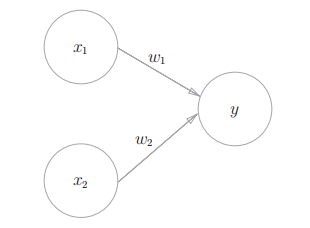
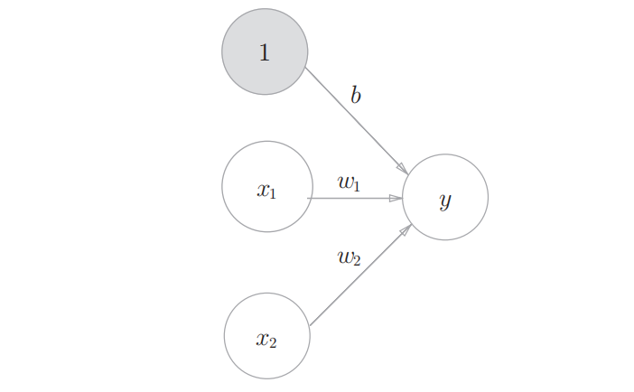
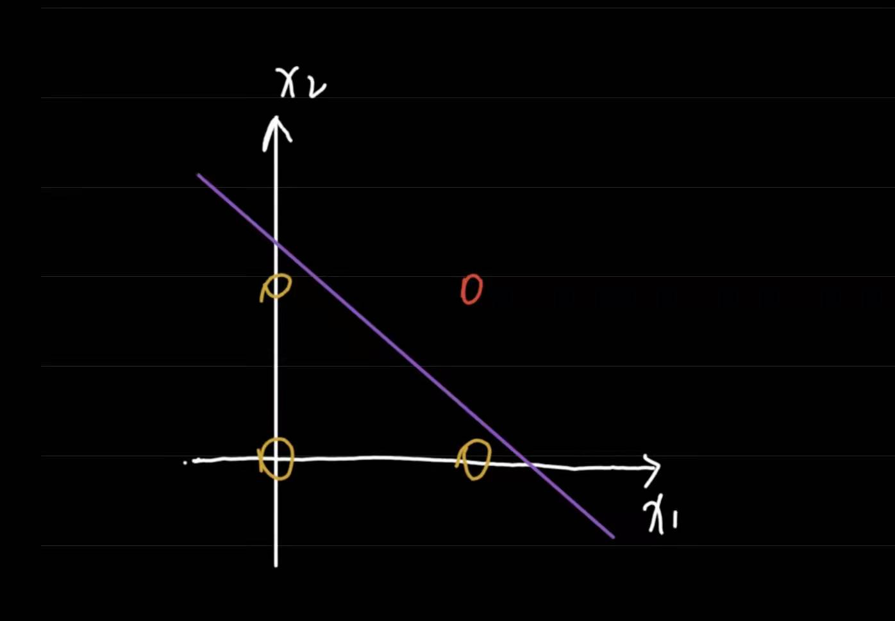
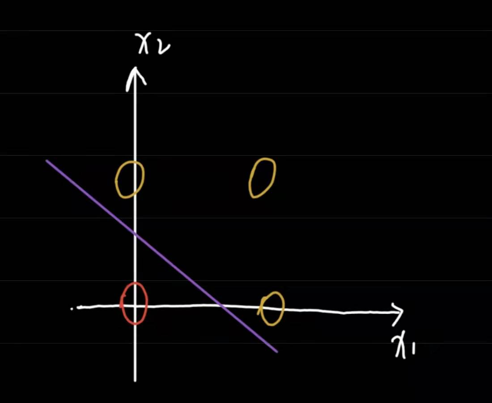
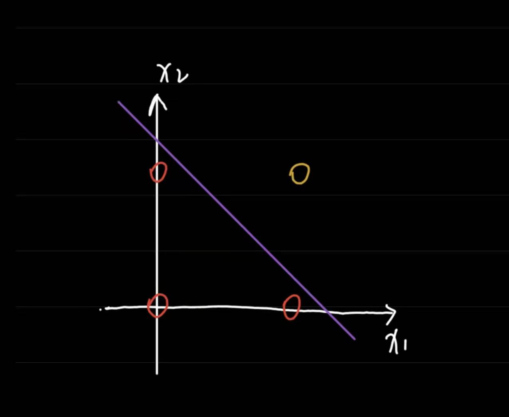
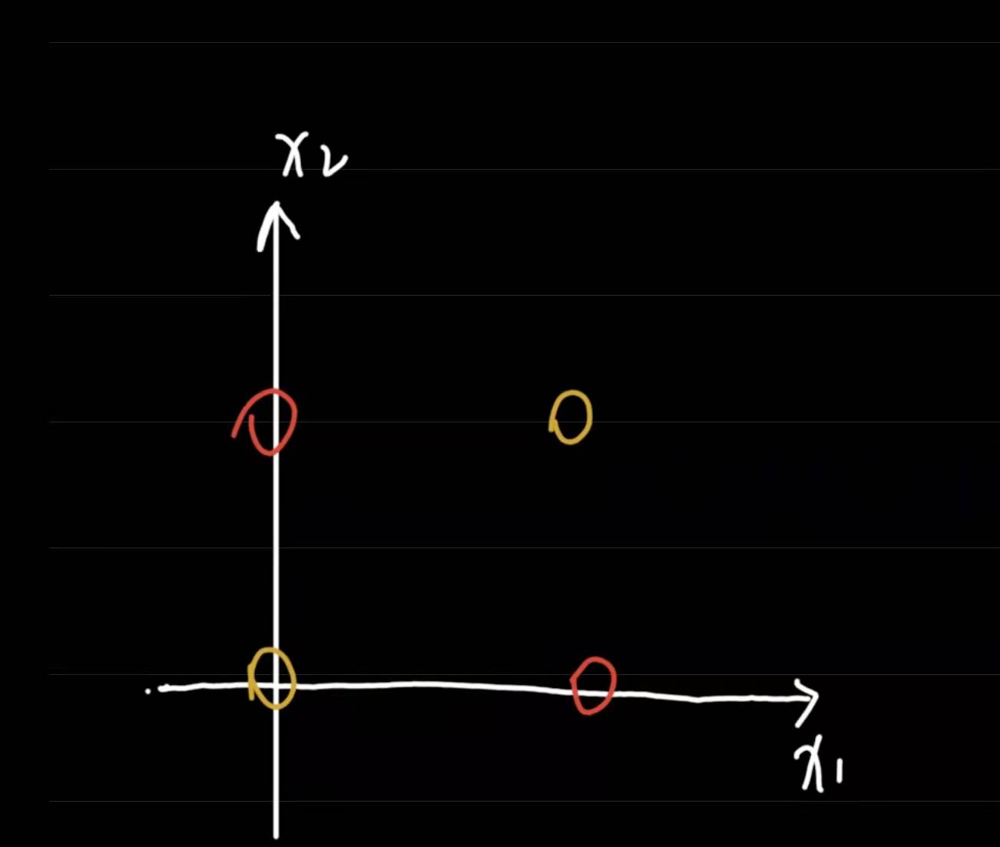
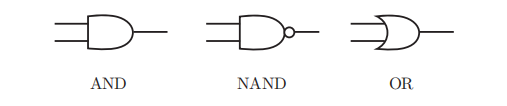
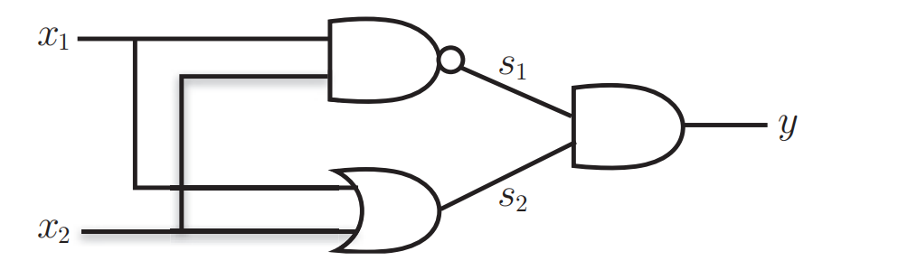

感知机接收多个输入信号，输出一个信号。这里所说的“信号”可以想象成电流或河流那样具备“流动性”的东西。像电流流过导线，向前方输送电子一样，感知机的信号也会形成流，向前方输送信息。但是，和实际的电流不同的是，感知机的信号只有“流/不流”（1/0）两种取值。[^1]

[^1]:  深度学习入门：基于Python的理论与实现. [日］斋藤康毅

感知机的数学公式如下：
$$
y = \left\{
    \begin{matrix}
        0  , w_1x_1 + w_2x_2\le\theta \\ 
        1  ,w_1x_1 + w_2x_2\gt\theta
    \end{matrix}
    \right.
$$

$x_1, x_2$是输入；$w_1, w_2$是权重(weight),；$\theta$代表阈值，当$w_1x_1+w_2x_2\gt\theta$代表神经元被激活了，反之未被激活。

<center style="font-size:10px;margin-bottom:10px;">一个⚪代表一个神经元</center>

我们把公式中的$\theta$移到左边，得到
$$
y = \left\{
    \begin{matrix}
        0  , w_1x_1 + w_2x_2+b\le 0 \\ 
        1  ,w_1x_1 + w_2x_2+b\gt 0
    \end{matrix}
    \right.
$$
其中$b=-\theta$， 我们把b称为偏置(bias)

我们可以把这个公式形象化地想象成这副样子：


## 用感知机实现逻辑门

**与门实现：**

与门只有在两个输入都为1时，才会返回1，否则返回0，它的真值表如下：
x1  | x2  | y
----|---- |----
0    |   0  |  0
0    |   1  |  0
1    |   0  |  0
1    |    1 |  1

我们可以把与门可视化：

黄色圈圈代表0，红色圈圈代表1，只需要用一条紫色的直线，就可以把0和1区分开来，这就是传说中的线性可分。
注意：**这条紫色的直线并不唯一**

**Python实现：**
```python
import numpy as np

def AND(x1, x2):
    x = np.array([x1, x2, 1])
    w = np.array([1, 1, -1])
    if np.sum(x*w) > 0:   # x1*w1+x2*w2 + b > 0
        return 1
    return 0

test = [[0, 0], [0, 1], [1, 0], [1, 1]] # 测试
for x in test:
    print(x, AND(x[0], x[1]))
```
运行结果：
```txt
[0, 0] 0
[0, 1] 0
[1, 0] 0
[1, 1] 1
```
在以上代码中，我们把$w_1, w_2, b$分别设置为1, 1, -1, 事实上有无穷多的取值，同样可以达到我们的预期，比如 (0.5, 0.5, -0.7)

**或门实现：**

或门：只要存在一个输入为1，则结果是1，否则为0
同样我们可以把或门的所有结果在坐标轴上表示出来：

黄色圈圈在这里表示1，红色表示0，同样可以轻松找到无数条直线进行分离

**Python实现：**
```python
import numpy as np

def OR(x1, x2):
    x = np.array([x1, x2, 1])
    w = np.array([0.6, 1, -0.5])
    if np.sum(x*w) > 0:
        return 1
    return 0


if __name__ == "__main__":
    test = [[0, 0], [0, 1], [1, 0], [1, 1]]
    for x in test:
        print(x, OR(x[0], x[1]))
```

运行结果：
```txt
[0, 0] 0
[0, 1] 1
[1, 0] 1
[1, 1] 1
```

**与非门实现：**
与非门就是把与门的结果取反
x1  | x2  | y
----|---- |----
0    |   0  |  1
0    |   1  |  1
1    |   0  |  1
1    |    1 |  0

红色代表1，黄色代表0，依然可以找到至少一条直线进行分割

**Python实现：**
```python
import numpy as np

def NAND(x1, x2):
    x = np.array([x1, x2, 1])
    w = np.array([-0.5, -0.5, 0.7])
    if np.sum(x*w) > 0:
        return 1
    return 0

if __name__ == "__main__":
    test = [[0, 0], [0, 1], [1, 0], [1, 1]]
    for x in test:
        print(x, NAND(x[0], x[1]))
```
运行结果：
```txt
[0, 0] 1
[0, 1] 1
[1, 0] 1
[1, 1] 0
```

**异或门实现：**
异或门的真值表：
x1  | x2  | y
----|---- |----
0    |   0  |  0
0    |   1  |  1
1    |   0  |  1
1    |    1 |  0

不妨把异或门也画出来：

然后我们发现，没有办法划出一条直线，使得红色点与黄色点分布在直线的两边。
说人话就是：找不到一条直线，对黄色点与红色点进行分类。
结论：**异或门无法使用单层感知机实现**。

但是经过逻辑推导之后，发现异或门可以用与非门和或门组合实现。
首先要认识与门、或门、与非门的符号表示;

然后我们可以这样表示异或门：


**Python实现：**
```python
def XOR(a, b):
    x1 = OR(a, b) # s1
    x2 = NAND(a, b) # s2
    return NAND(x1, x2) # y

if __name__ == "__main__":
    test = [[0, 0], [0, 1], [1, 0], [1, 1]]
    for x in test:
        print(x, XOR(x[0], x[1]))
```
运行结果：
```txt
[0, 0] 1
[0, 1] 0
[1, 0] 0
[1, 1] 1
```
结合了上面写的NAND和OR函数，我们就实现异或门啦~
实际上我们把不同种感知机进行组合的过程就可以看作是多层感知机：

上图中的s1, s2代表的就是代码中对应的注释的位置

[>>>感知机（2）<<<](/post/ji-qi-ren-shi-jian-gan-zhi-ji-2/)
