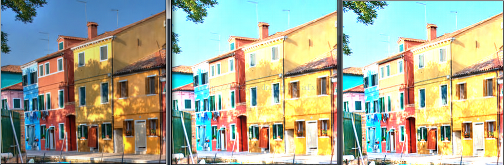

StackOverflow上看到的一个简单图像处理算法，产生的图像与PS结果类似。

```cpp
int row = inputImg.rows;
int step = inputImg.step;
uchar* pInputImg = inputImg.data;
uchar* pOutputImg = outputImg.data;
for (int i = 0; i < row * step; i++)
{
	pOutputImg[i] = (uchar)min_uchar(255, max_uchar(0, pInputImg[i] * pow(2, strength)));
}
```
