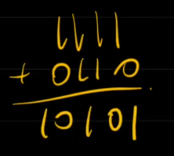
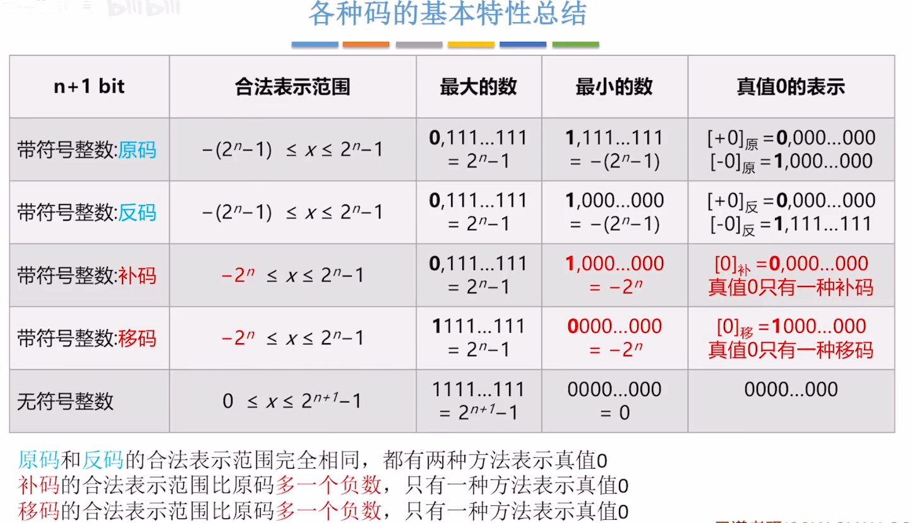
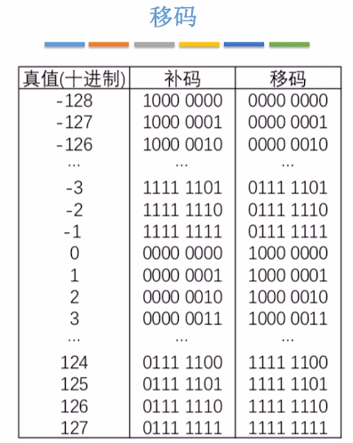
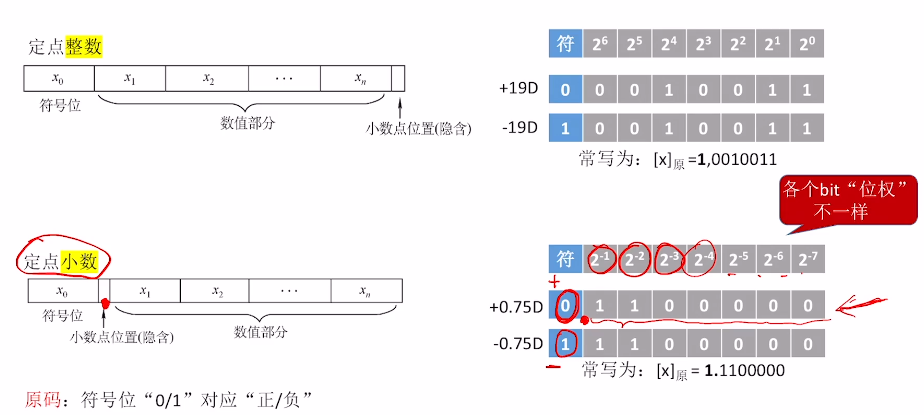
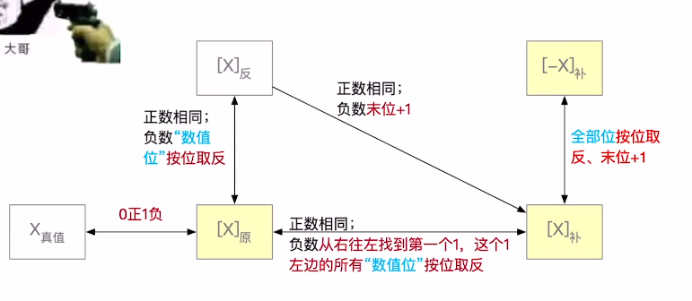
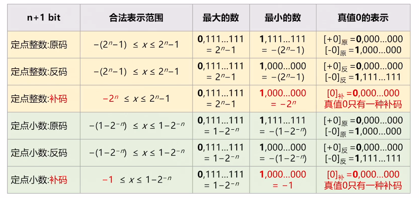
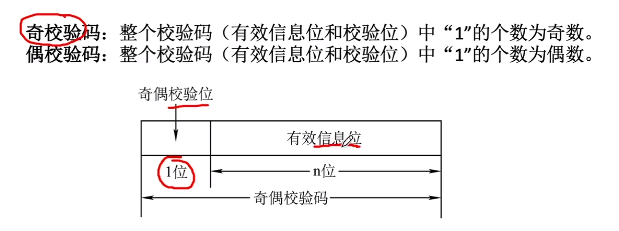

# 02.数据表示

## BCD

### 8421

8421 只表示一位十进制数所以表示范围是 0~9, 如果>=10 则要+6

```
    7  +  8
= 0111 + 1000
= 1111
```

但是 15 用 8421 表示是 `0001 0101`, 这时候通过对`1111`+6:

得到`0001 0101`, 恰好是 15

### 余三码

那为了解决上述 +6 的问题, 出现了余三码, 对 0-9 范围内的数以 8421 码表示之后全都+3,这样后期进行加减运算之后就不需要考虑数字是否落在 0-9 范围内, 然后为大于 9 的数单独+6 了.

余三码不具有有权性, 属于无权码, 而 8421 属于有权码.

### 2421 码

每一个 2421 码只要与自身按位取反，便可得到该数按 9 的补数的 2421 码，比如 4 的 2421 码 0100 自身取反后就变为了 1011，即 5 的 2421 码。2421 码可以给运算带来方便，因为可以利用·其对 9 的补数将减法运算转变为加法运算

## 数据范围



移码就是对补码的符号位取反, 只能表示整数. 所以移码数据范围和补码一样


移码刚好是 0x00~0xff, 适合在电路中对比大小, 常用于表示浮点数的阶码.

## 定点小数^[【王道计算机考研 计算机组成原理】 https://www.bilibili.com/video/BV1ps4y1d73V/?p=14&share_source=copy_web&vd_source=0a7e9572278635efd730c0077f8e7b45]




**定点小数的转码规则:**


加减规则也一样, 先转成补码然后运算.

:::tips
符号位也参与运算
:::

**数据范围:**


定点小数拓展位数的时候 0 是追加在末尾, 定点整数拓展时 0 插入在符号位与数值位中间.

## 奇偶校验码



偶较验位的计算: 对有效信息位按位 xor

校验过程: 对奇偶校验码安位 xor, 是 1 则出错

## 算术逻辑单元(ALU)
  
`同或`是对xor进行取反