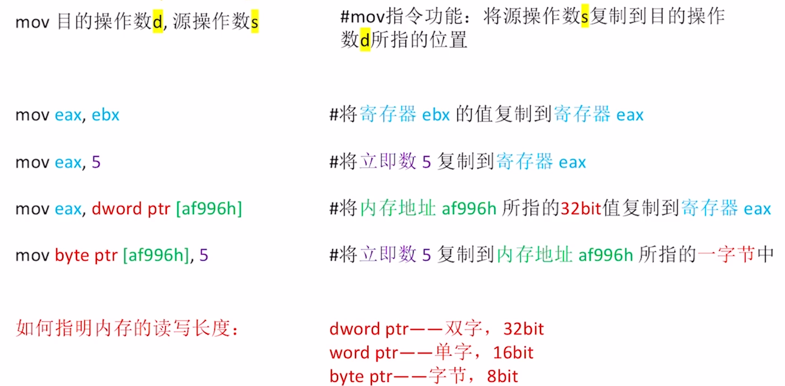
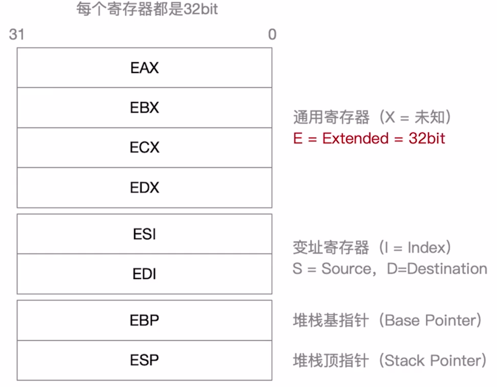
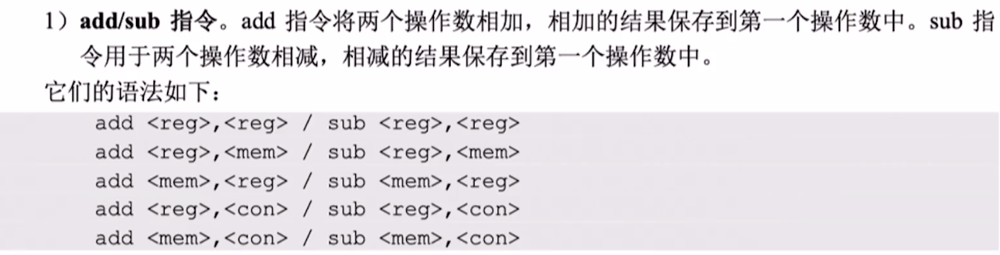
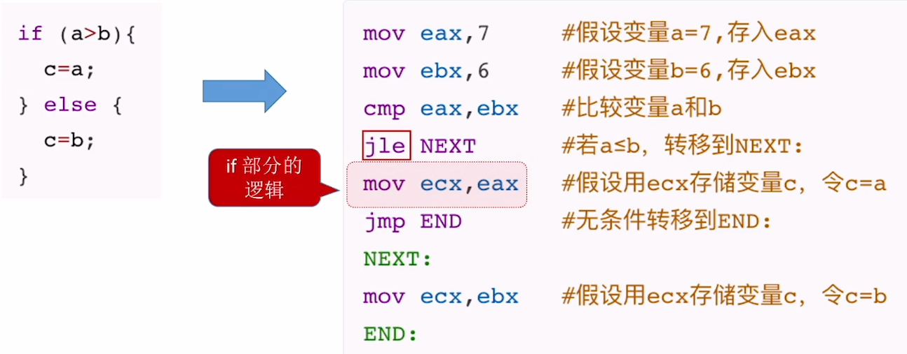

# x86 汇编基础

eg: mov

## 寄存器

- AX, BX, CX, ...: 通用寄存器的 E 去掉的话, 意思是使用该寄存器的低十六位.
- AH, BH, CH, ...: 表示使用 AX, BX, CX, ...的高 8 位
- AL, BL, CL, ...: 表示使用 AX, BX, CX, ...的低 8 位

## 各种寻址方式

## 常用汇编指令

**x86 汇编语言中两个操作数不可以都来自主存, 不然访存次数太多了, 执行会很慢**

### 常见算术运算指令

### 常见逻辑运算指令

### AT&T 格式

- AT&T: Unix/Linux 常用格式(贝尔实验室发明)
- Intel: Windows 常用

如此看来还是 Intel 格式比较简洁, 符合笔者的口味().

 ### if-else

 

 ### 循环

  