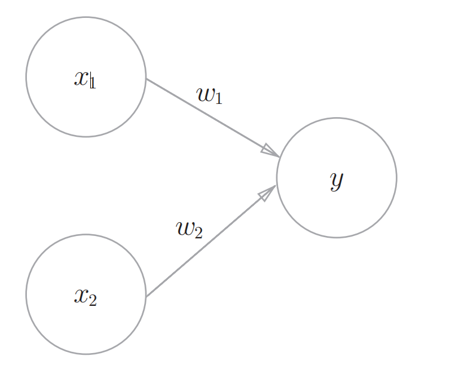
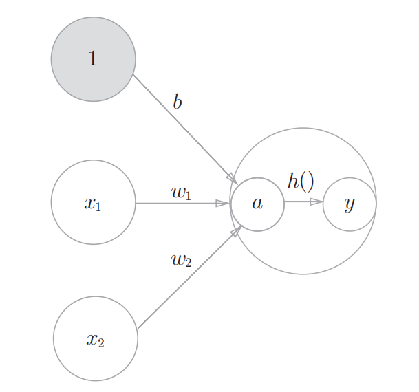
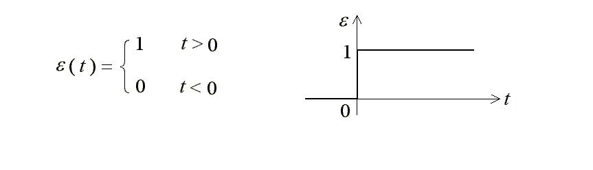
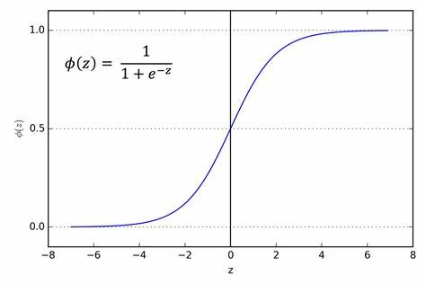
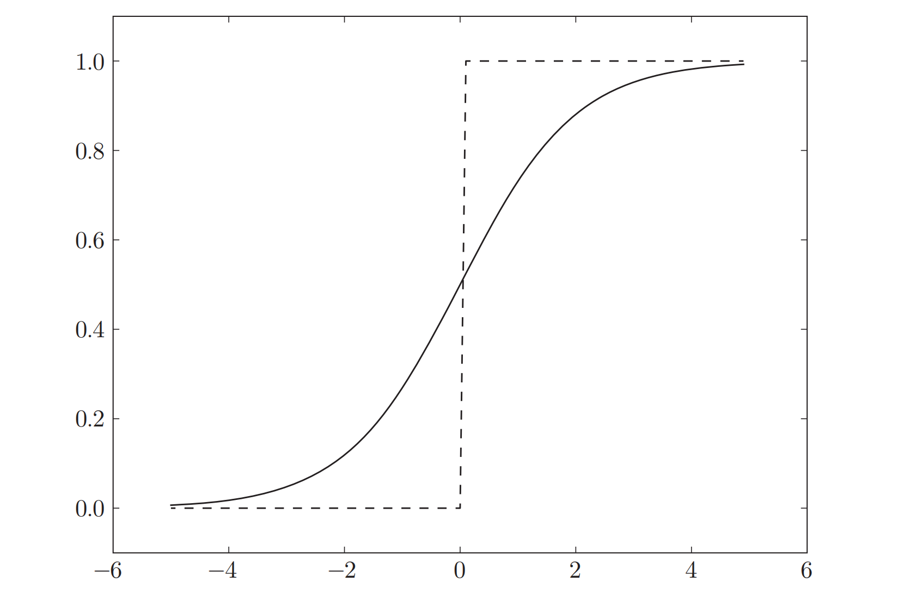
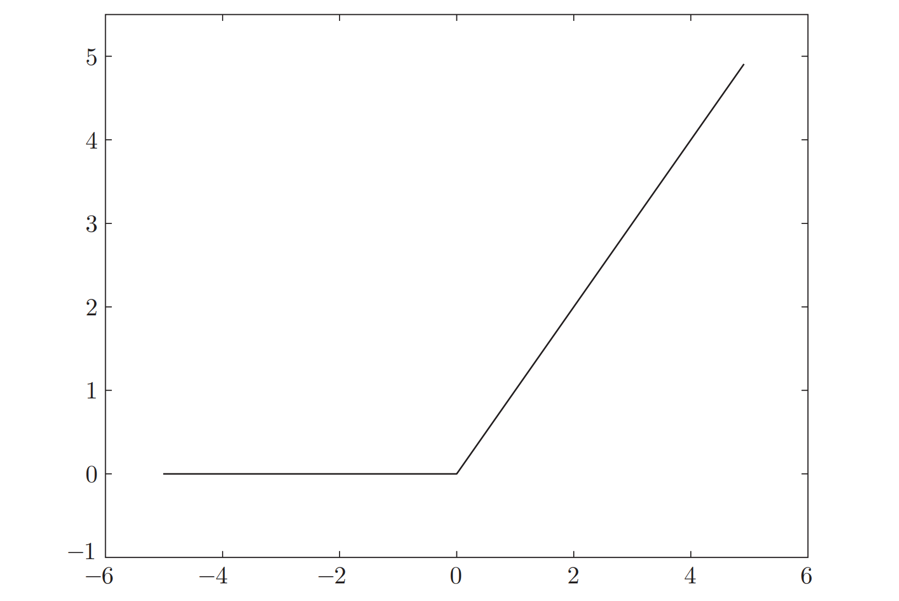

先来看看我们[上一次](./%E6%9C%BA%E5%99%A8%E4%BA%BA%E5%AE%9E%E8%B7%B5-%E6%84%9F%E7%9F%A5%E6%9C%BA%EF%BC%881%EF%BC%89)实现的完整代码

```python
import numpy as np

def OR(x1, x2):
    x = np.array([x1, x2, 1])
    w = np.array([0.6, 1, -0.5])
    if np.sum(x*w) > 0:
        return 1
    return 0

def AND(x1, x2):
    x = np.array([x1, x2, 1])
    w = np.array([1, 1, -1])
    if np.sum(x*w) > 0:
        return 1
    return 0

def NAND(x1, x2):
    x = np.array([x1, x2, 1])
    w = np.array([-0.5, -0.5, 0.7])
    if np.sum(x*w) > 0:
        return 1
    return 0

def XOR(a, b):
    x1 = OR(a, b)
    x2 = NAND(a, b)
    return NAND(x1, x2)

if __name__ == "__main__":
    test = [[0, 0], [0, 1], [1, 0], [1, 1]]
    for x in test:
        print(x, XOR(x[0], x[1]))
```

不难发现，每个函数的前三行都是类似的形式，于是我们可以把它抽象成 preceptron 函数，于是得到了以下代码

```python
import numpy as np

def preceptron(x1, x2, w1, w2, b):
    x = np.array([x1, x2, 1])
    w = np.array([w1, w2, b])
    tmp = np.sum(x * w)
    if tmp > 0:
        return 1
    return 0

def AND(x1, x2):
    return preceptron(x1, x2, 1, 1, -1)

def NAND(x1, x2):
    return preceptron(x2, x2, -0.5, -0.5, 0.7)

def OR(x1, x2):
    return preceptron(x1, x2, 0.6, 1, -0.5)

def XOR(a, b):
    x1 = OR(a, b)
    x2 = NAND(a, b)
    return NAND(x1, x2)

if __name__ == "__main__":
    test = [[0, 0], [0, 1], [1, 0], [1, 1]]
    for x in test:
        print(x, XOR(x[0], x[1]))
```

这时候我们回头再看一下感知机的网络图


我们发现图中并没有 b 这个变量，所以我们可以把这张图完善一下


其中$a=w_1*x_1+w_2*x_2+b*1$，把$a$作为输入，经由 h 函数，得到 y

$$
        a = w_1 * x_1+w_2 * x_2 + b \\
        y = h(a)
$$

不难发现，h()所做的就是判断 a 是否大于 0，如果大于 0 则返回 1，否则返回 0，正因为我们可以用它表示状态，因此我们把它称为激活函数，激活函数有很多种，一般来说，不同的激活函数会得到不同的结果。激活函数是连接感知机和神经网络的桥梁[^1]。

[^1]: 深度学习入门：基于 Python 的理论与实现. [日］斋藤康毅

接下来介绍一下常见的几种激活函数。

## 阶跃函数

```python
def step_function(x):
    if x > 0:
        return 1
    else:
        return 0
```

阶跃函数的输出只有两种情况，缺点是无法求导


## sigmoid 函数

$$
        h(x) = \frac{1}{1+e^{-x}}
$$

sigmoid 函数图像如下：



我们可以把阶跃函数和 sigmoid 函数重叠起来：


可以发现，二者去区别在于，sigmoid 函数很光滑，可以取到(0, 1)区间内任何一个实数，而阶跃函数只能取到 0 或 1. 因此，我们在感知机中使用阶跃函数，在神经网络中，则趋向于使用光滑的激活函数。

## ReLU 函数(斜坡函数)

在神经网络发展的历史上，sigmoid 函数很早就开始被使用了，而最近则主要使用 ReLU（Rectified Linear Unit）函数。[^1]

$$
    h(x) = \left\{
        \begin {matrix}
            x, x \gt 0 \\
            0, x \le 0
        \end{matrix}
        \right.
$$



**代码实现：**

```python
def relu(x):
    return max(0, x)
```

## 改写代码

在了解了激活函数之后，我们发现感知机代码可以进一步解耦——把激活函数抽离出去。

```python
import numpy as np

def step_function(x): # 阶跃函数
    if x > 0:
        return 1
    return 0

def linear(x1, x2, w1, w2, theta): # 计算 a = x1*w1 + x2*w2 +b
    x = np.array([x1, x2, 1])
    w = np.array([w1, w2, theta])
    tmp = np.sum(x * w)
    return tmp

def preceptron(x1, x2, w1, w2, theta):
    res = linear(x1, x2, w1, w2, theta)
    return step_function(res)

def AND(x1, x2):
    return preceptron(x1, x2, 1, 1, -1)

def NAND(x1, x2):
    return preceptron(x2, x2, -0.5, -0.5, 0.7)

def OR(x1, x2):
    return preceptron(x1, x2, 0.6, 1, -0.5)

def XOR(a, b):
    x1 = OR(a, b)
    x2 = NAND(a, b)
    return NAND(x1, x2)

if __name__ == "__main__":
    test = [[0, 0], [0, 1], [1, 0], [1, 1]]
    for x in test:
        print(x, XOR(x[0], x[1]))
```
