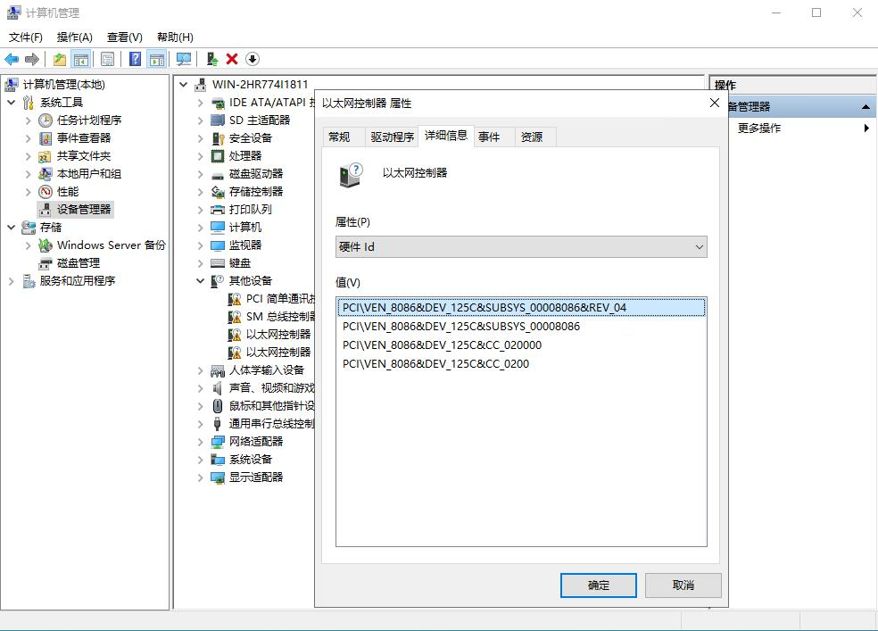
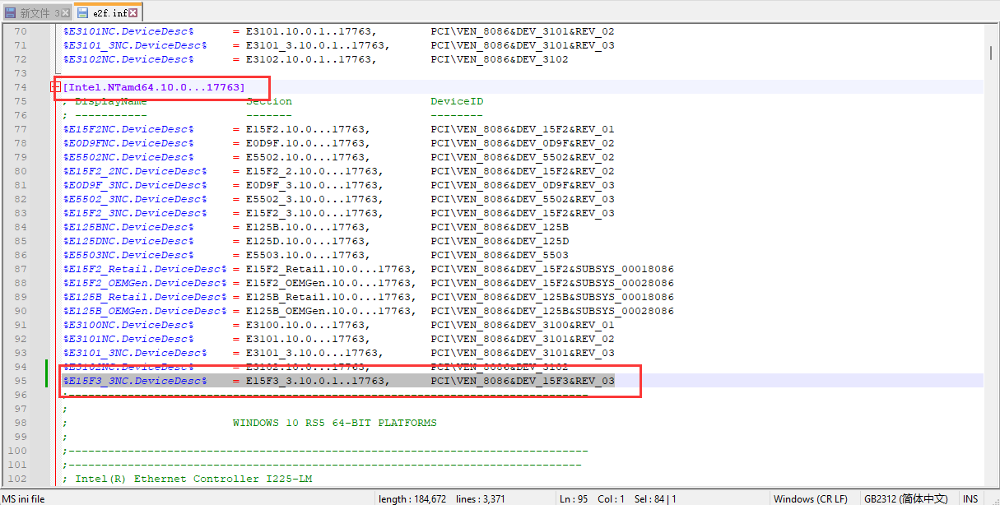
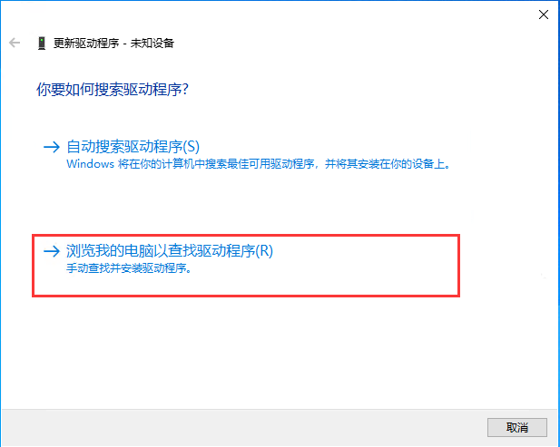

# Windows Server 2022 下安装B650E-E的驱动

## 网卡驱动

该章内容参考自[Windows Server 2022安装Intel I225-V/I226-V驱动](https://www.quarkbook.com/?p=1414)

B650E-E的网卡型号是 Intel I225V 2.5Gb, 属于桌面端产品线，-LM后缀的才属于商业端产品线，默认情况下，Windows Server只能安装商业端产品线的网卡驱动。我们通过魔改配置文件可以绕过这一限制。

### 0. Intel官网下载驱动

[Intel I225-V驱动](https://www.intel.cn/content/www/cn/zh/products/sku/184676/intel-ethernet-controller-i225v/downloads.html)

### 1. 找到网卡的硬件ID

安装好Windows Server 2022之后，在设备管理器中找到网卡，然后右键->属性->详细信息。选择硬件ID，记下第一行的硬件ID。



I225-V B3的硬件ID是 `PCI\VEN_8086&DEV_125C&SUBSYS_00008086&REV_04`

在驱动程序的inf文件中查找得知，I226网卡ID为

```
PCI\VEN_8086&DEV_125C

//I225-V B3 ID为：PCI\VEN_8086&DEV_15F3&REV_03
```

### 2. 修改驱动

下载驱动之后，解压驱动，找打并打卡`PRO2500\Winx64\WS2022\e2f.inf`文件。

然后在这个文件里面搜素上面拿到的硬件ID `PCI\VEN_8086&DEV_125C`。找到这一行之后，将这一行复制到节点`[Intel.NTamd64.10.0...17763]`下面：



### 3. 安装驱动

进入Windows Server 2022，在CMD（管理员身份）中依次输入下面两条命令，然后重启机器。

```sh
bcdedit -set loadoptions DISABLE_INTEGRITY_CHECKS
bcdedit -set TESTSIGNING ON
```

这一步使为了禁用驱动程序签名和开启测试模式，修改了inf之后，过不了签名验证，但是禁用驱动程序签名验证之后，就可以正常安装了。

重启之后，在设备管理器中，右键需要安装驱动的网卡，选择“更新驱动程序和软件”。



然后选择“浏览我的电脑以查找驱动程序”，找到刚刚修改的驱动，点击下一步，选择“始终安装此驱动程序软件”。然后I226-V的驱动就安装好了。

驱动都安装完成之后，在CMD（管理员身份）中依次输入下面两条命令，关闭测试模式。

```sh
bcdedit -set loadoptions ENABLE_INTEGRITY_CHECKS
bcdedit -set TESTSIGNING OFF
```

