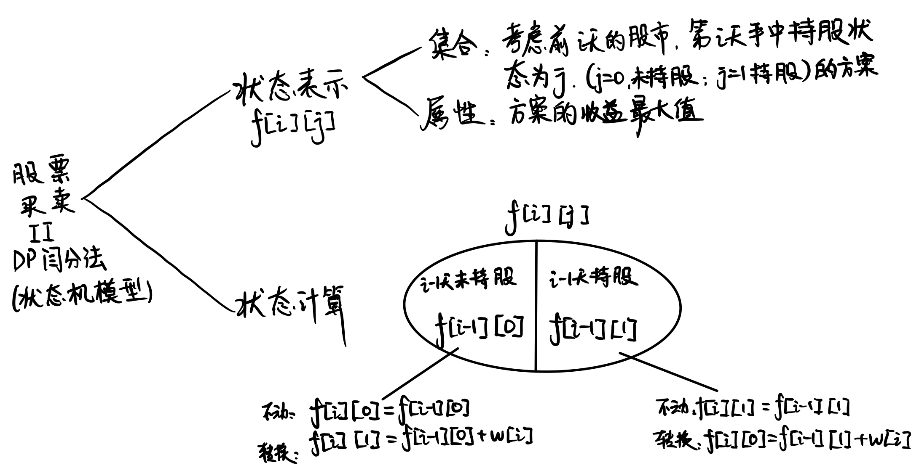
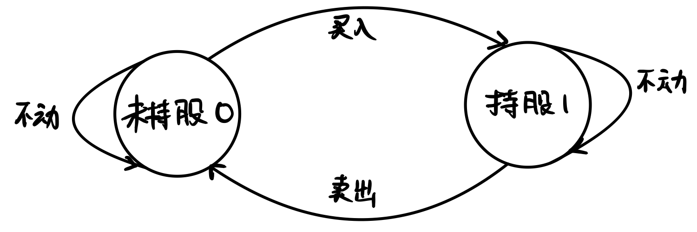
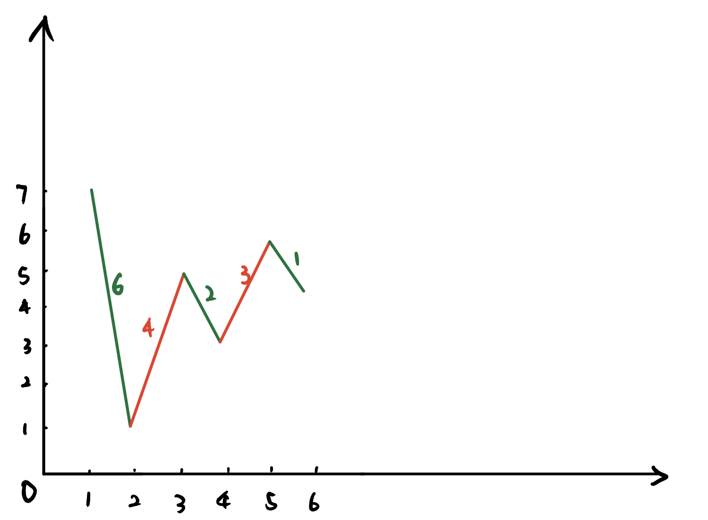
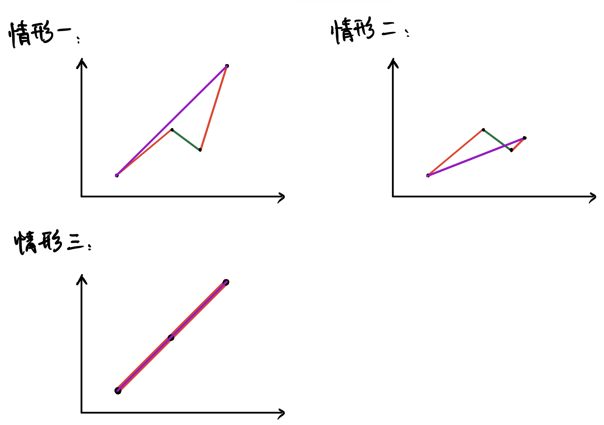

又是一道DP题！

<!--more-->

## 题目

给定一个长度为 N 的数组，数组中的第 i 个数字表示一个给定股票在第 i 天的价格。

设计一个算法来计算你所能获取的最大利润。你可以尽可能地完成更多的交易（多次买卖一支股票）。

注意：你不能同时参与多笔交易（你必须在再次购买前出售掉之前的股票）。

**输入格式**
第一行包含整数 N，表示数组长度。

第二行包含 N 个不大于 10000 的正整数，表示完整的数组。

**输出格式**
输出一个整数，表示最大利润。
**数据范围**

    1≤N≤105
**输入样例1：**

    6
    7 1 5 3 6 4
**输出样例1：**

    7
**输入样例2：**

    5
    1 2 3 4 5
**输出样例2：**

    4
**输入样例3：**

    5
    7 6 4 3 1
**输出样例3：**

    0
**样例解释**
样例1：在第 2 天（股票价格 = 1）的时候买入，在第 3 天（股票价格 = 5）的时候卖出, 这笔交易所能获得利润 = 5-1 = 4 。随后，在第 4 天（股票价格 = 3）的时候买入，在第 5 天（股票价格 = 6）的时候卖出, 这笔交易所能获得利润 = 6-3 = 3 。共得利润 4+3 = 7。

样例2：在第 1 天（股票价格 = 1）的时候买入，在第 5 天 （股票价格 = 5）的时候卖出, 这笔交易所能获得利润 = 5-1 = 4 。注意你不能在第 1 天和第 2 天接连购买股票，之后再将它们卖出。因为这样属于同时参与了多笔交易，你必须在再次购买前出售掉之前的股票。

样例3：在这种情况下, 不进行任何交易, 所以最大利润为 0。


## 解析1





一共只22有种状态:

**1. 当前处于未持股状态0：**

    对应可以进行的转换：
    0->0 （不买入，继续观望，那么就什么都不发生）
    0->1 （买入股票，那么收益就要减去当前市场的股票价格）
**2. 当前处于持股状态1：**

    对应可以进行的转换：
    1->1 （不卖出，继续观望，那么就什么都不发生）
    1->0 （卖出股票，那么收益就要加上当前市场的股票价格）

### 代码

```cpp
#include <iostream>
using namespace std;

int f[100005][2];
int a[100005];

int main()
{
    int n;
    cin>>n;
    for(int i=1;i<=n;i++)
    {
        cin>>a[i];
    }
    f[0][1]=- 0x3f3f3f3f;
    for(int i=1;i<=n;i++)
    {
        f[i][0]=max(f[i-1][0],f[i-1][1]+a[i]);
        f[i][1]=max(f[i-1][1],f[i-1][0]-a[i]);
    }
    cout<<f[n][0];
}
```

## 解法二

**用贪心算法做！**
纵然，我们可以用DP搜索出所有的方案数，但是通过观察，我们可以发现本题最优解方案存在一定的性质。

测试样例的折线图形式（绿色标出下降，红色标出上升）：



考虑一种方案，在每次上升的前一天购入股票，并在上升后的当天卖出的方案

    if (w[i] > w[i - 1])
        res += w[i] - w[i - 1];
接下来证明该贪心思路得出的方案即是最优解。

**（1）证明贪心解 ≤≤ 最优解：**
由于贪心解都是取区间长度为 11 的解，因此假设存在于最优解中的某个区间 [i,j][i,j] 的长度 >1>1
那么会出现一下三种情况：

对应三种情形：最优解选取的区间最终点位于上方、下方、相等。

对于情形一：显然 最优解 << 贪心解
对于情形二：显然 最优解 << 贪心解
对于情形三：毫无疑问，这就是存在于贪心解中的情形，因此 贪心解 == 最优解

得证

（2）证明贪心解 ≥≥ 最优解：
这部分无需证明，因为贪心解即是合法解，所以他的方案必定大于等于最优解

### 代码

```cpp
#include <iostream>
using namespace std;
const int N = 1e5 + 10, INF = 0x3f3f3f3f;
int n;
int w[N];

int main() {
    scanf("%d", &n);
    for (int i = 1; i <= n; ++i) scanf("%d", &w[i]);

    int res = 0;
    for (int i = 2; i <= n + 1; ++i) {
        if (w[i] - w[i - 1] > 0) res += w[i] - w[i - 1];
    }
    printf("%d\n", res);
    return 0;
}
```
