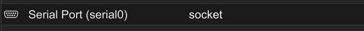

# PVE给Debain虚拟机开启xterm.js

## 1. 添加串口

首先在PVE的GUI里为该虚拟机添加串口设备：



## 2. 修改GRUB配置

修改 `/etc/default/grub` 中的 `GRUB_CMDLINE_LINUX` 参数，直接在原有的字段后面追加上`quiet console=tty0 console=ttyS0,115200`即可：

```
GRUB_CMDLINE_LINUX="<这里可能一开始就有内容> quiet console=tty0 console=ttyS0,115200"
```

## 3. 更新GRUB配置

对于debian而言，只需要执行以下指令即可

```sh
update-grub
```

## 4. 重启

重启虚拟机即可

## 需要注意的点

在PVE中选择用`xterm.js`打开之后会显示`starting serial terminal on interface serial0`，这个时候需要按一下回车，才会提示登录。

