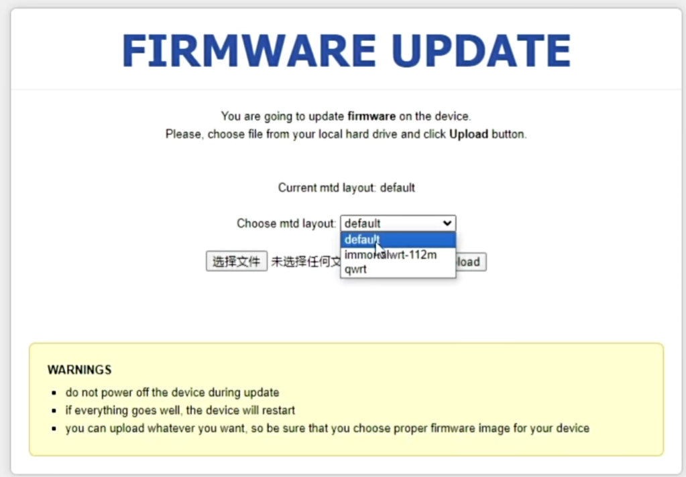

本文的路由器为 AX3000T，出厂固件 1.0.63，设备名 RD03，其他型号的路由器仅供参考！

<!-- more -->

## 开启 SSH

首先，我使用 [xmir-patcher](https://github.com/openwrt-xiaomi/xmir-patcher)给路由器开启 SSH 服务，并固化^[https://www.right.com.cn/forum/thread-8404955-1-1.html]：

1. 先选择 `1 - Set IP-address` 来设置路由器的IP地址（一般是192.168.31.1）
2. 在选择 `2 - Connect to device (install exploit)` 来开启SSH服务，这一步可能需要输入WiFi密码
3. 选择`8 - {{{ Other functions }}}`
4. 选择`2 - Change root password`, 来设置root密码

此时 SSH 已经顺利启动了, 但是每次重启之后都会丢失, 为此我们需要固化 SSH:

1. 还是在 xmir-patcher 里选择 `8 - {{{ Other functions }}}`
2. 然后选择 `7 - Install permanent SSH`

🆗 至此, 第一步已经完成了, 可以尝试使用 SSH 连接路由器试试, 如果遇到报错 `Unable to negotiate with 192.168.31.1 port 22: no matching host key type found. Their offer: ssh-rsa`, 可以尝试使用这条指令来连接^[https://www.right.com.cn/FORUM/thread-8238692-1-1.html]:

```sh
ssh -o HostKeyAlgorithms=+ssh-rsa -o PubkeyAcceptedKeyTypes=+ssh-rsa root@192.168.31.1
```

**本文暂不包含备份固件的说明，从这里开始请自行做好备份或其他预防措施！**


## 刷入系统

### 准备工作

在刷系统前，需要事先准备好两个文件，分别是 uboot 和 immortalWrt。

#### 下载 uboot

uboot 和 breed 都是 bootloader，可以作为底层来运行我们的路由器固件（最常见的固件是 openwrt），能够有效防止在刷机过程中因意外导致路由器变砖的情况。

我看了很多文章，基本上都是给 AX3000T 刷 uboot 系统，稳妥起见，本文也选择 uboot。

进入 https://github.com/hanwckf/bl-mt798x/releases 下载作者提供的最新的压缩包，解压之后里面有对应芯片以及对应路由器型号的分区文件，我们选择 `mt7981_ax3000t-fip-fixed-parts-multi-layout.bin`，其中 `fip` 表示要刷入路由器的FIP分区，`multi-layout` 表示可以选择多种布局模式（下文会介绍）。

#### 下载 immortalWrt

进入 https://firmware-selector.immortalwrt.org/?version=23.05.2&target=mediatek%2Ffilogic&id=xiaomi_mi-router-ax3000t 选择下载 `SYSUPGRADE`。

### 刷入 uboot

**从这里开始可能会对路由器造成破坏，请谨慎！**

上文中，我们为路由器启动了 SSH 服务，因此这里我们能够通过 scp 把我们下载的 `mt7981_ax3000t-fip-fixed-parts-multi-layout.bin` 上传到路由器的 /tmp 目录下。

然后执行这条指令，把数据写入FIP分区：

```sh
mtd write /tmp/mt7981_ax3000t-fip-fixed-parts-multi-layout.bin FIP
```

接着，我们把路由器电源拔掉，按住reset键不松手，同时接通电源，当看到LED灯变成蓝色时松手。到这一步，我们已经顺利把 uboot 刷入路由器了，但是想要进入 uboot 的WebUI，还需要动动手操作一下：

1. 使用网线把路由器和电脑连接
2. 连接上路由器后，把电脑的IP改为静态IP：192.168.1.2，子网掩码是 255.255.255.0
3. 在浏览器点开 http://192.168.1.1



这里我们选择 default^[https://github.com/hanwckf/bl-mt798x/issues/52#issuecomment-2066323602]，然后上传 immortalWrt，提交之后他就会自动重启，等待一段时间。看到蓝灯常亮，说明刷入成功, 在浏览器打开 http://192.168.1.1 可以看到刚刚刷入的 immortalWrt 的WebUI。
