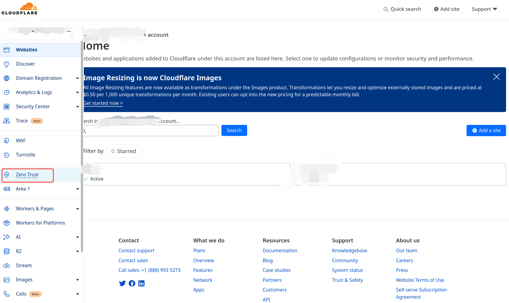
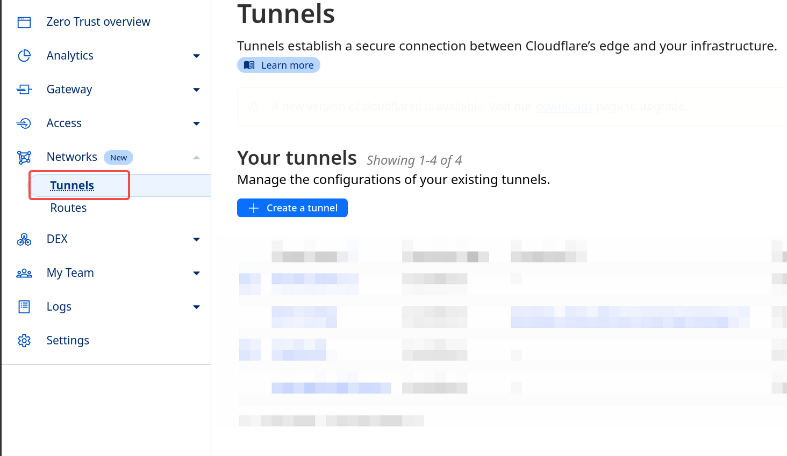
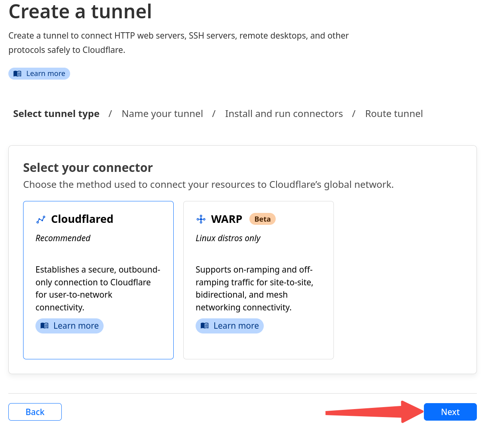
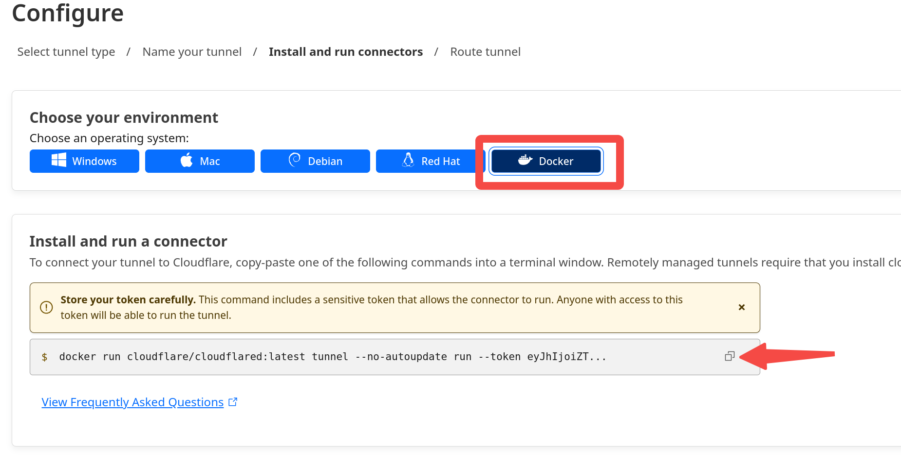
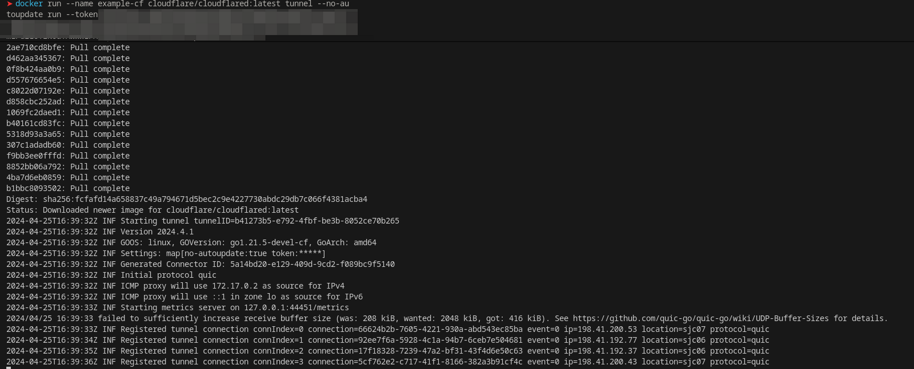
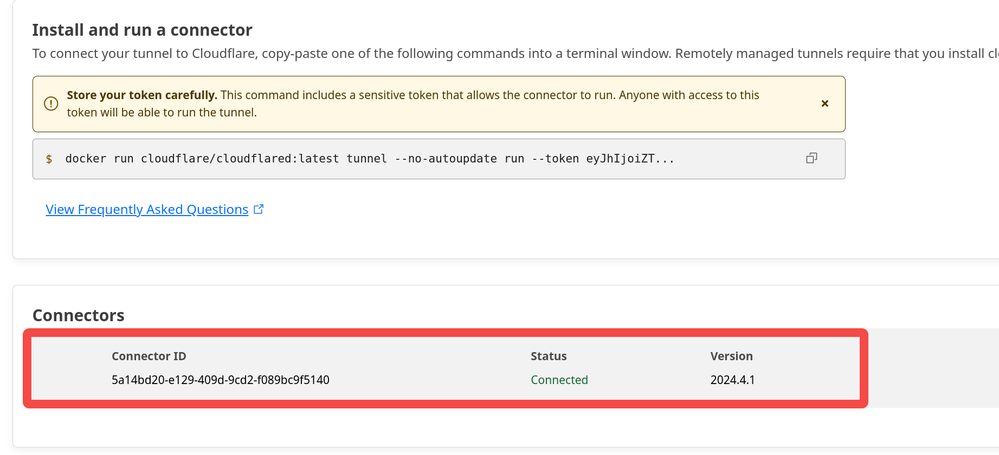
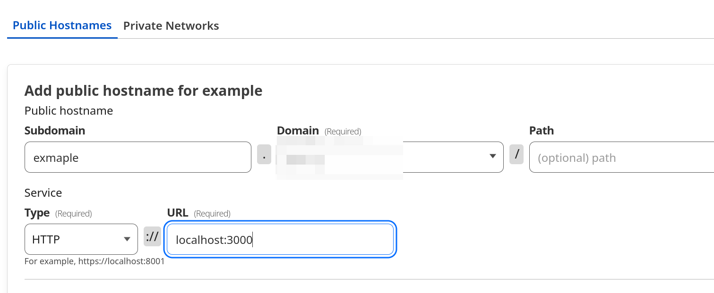

# 部署 llama3 + Web UI 实现外网访问

首先安装 nvidia 驱动和 docker, 为了让容器可以使用显卡，需要安装 NVIDIA Container Toolkit(NVIDIA Docker) , 此处不做赘述。

## 启动 nvidia cuda 容器

```sh
docker run -it --gpus all \
    --ipc=host \
    --ulimit memlock=-1 \
    --ulimit stack=67108864 \
    --name llama \
    nvcr.io/nvidia/pytorch:23.03-py3 bash
```

下载 [llama3 8B](https://huggingface.co/jartine/Meta-Llama-3-8B-Instruct-llamafile/resolve/main/Meta-Llama-3-8B-Instruct.Q5_K_M.llamafile)

授予可执行权限

```sh
chmod +x Meta-Llama-3-8B-Instruct.Q5_K_M.llamafile
```

在 tmux 中运行该应用

```sh
./Meta-Llama-3-8B-Instruct.Q5_K_M.llamafile \
    --gpu nvidia -ngl 999 -c 4096 \
    --port 8080
```

## 启动 WebUI 容器

```sh
docker pull yidadaa/chatgpt-next-web

docker run -d \
    --net container:llama \
    -e OPENAI_API_KEY='' \
    -e CODE=<YOUR PWD> \
    -e BASE_URL=http://localhost:8080 \
    --name llama-webui \
    yidadaa/chatgpt-next-web
```

## 使用 Cloudflare Tunnel 转发





点击创建 Tunnel



点击`Docker`，然后复制下面的指令



添加`--net`和`--name`参数，然后粘贴到主机的终端里执行：

```sh
docker run \
    --net container:llama-webui \
    --name llama-tunnel \
    cloudflare/cloudflared:latest tunnel --no-autoupdate run --token <YOUR TOKEN>
```



执行成功后，返回 cloudflare 的网页，可以看到 connectors 里面多出来了一个连接

**tips: 该指令建议在 tmux 中执行**



点击下一步，输入 subdomain，选择 domain，path 空着即可，协议选择 http,由于 webui 默认开在 3000 端口，所以 URL 处输入 `localhost:3000`



保存之后，就可以在外网访问了！

## 参考

- [Docker 网络模式详解及容器间网络通信](https://zhuanlan.zhihu.com/p/212772001)
- [llamafile](https://github.com/Mozilla-Ocho/llamafile)
- [使用 Docker 快速上手官方版 LLaMA2 开源大模型](https://zhuanlan.zhihu.com/p/644914669)
- [PyTorch container - nvidia](https://docs.nvidia.com/deeplearning/frameworks/pytorch-release-notes/rel-23-03.html)
- [ChatGPT-Next-Web](https://github.com/ChatGPTNextWeb/ChatGPT-Next-Web)
