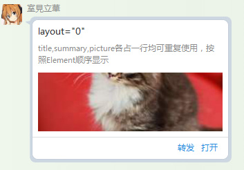
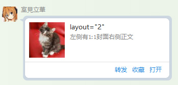
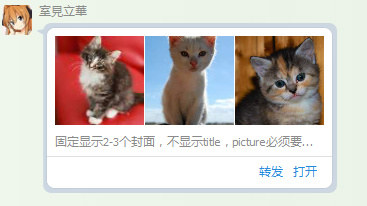
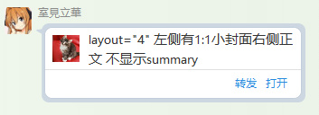
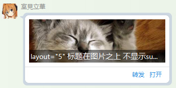

# QQ 的 XML 消息格式整理

Forked from [djkcyl/qq_message_xml.md](https://gist.github.com/koukuko/eb375cee7883764e01fb213b1ace4727)
QQ 可以使用 xml 的方式发送消息，以下为了方便描述统称为卡片。

## 发送方式

通过机器人的 API 进行发送 xml 即可，但是如果选择发送 xml，那么其他如`[image=xxx]`、`[@xxx]`这些命令就不可使用了。整个消息只有 XML。

## 基本结构

xml 主要由`msg`,`item`,`source`这 3 部分组成

```xml
<?xml version='1.0' encoding='utf-8' standalone='yes'?>
<!-- msg 卡片的基本属性 只可以有1个  -->
<msg flag='1' serviceID='1' brief='foobar' templateID='1' action='plugin' >
 <!-- item 卡片的内容 可重复使用  -->
 <item layout="0">
  <title>layout="0"</title>
        <summary>title,summary,picture各占一行均可重复使用，按照Element顺序显示</summary>
        <picture cover="http://placekitten.com/250/100"/>
 </item>
 <!-- source 卡片的来源，即卡片的角标 只可以有1个  -->
 <source name="koukuko" icon="https://avatars2.githubusercontent.com/u/3916013?v=3&s=40" url="" action="plugin" appid="-1"/>
</msg>
```

### `<msg>`

#### attribute

| attribute  | value           | description                                                                    |
| ---------- | --------------- | ------------------------------------------------------------------------------ |
| flag       | `0`,`1`,`2`,`3` | `0`默认，可以转发和收藏<br>`1`不能转发<br>`2`不能收藏<br>`3`不能收藏也不能转发 |
| serviceID  | `1`             | -                                                                              |
| brief      | `{String}`      | 卡片的简介，会显示于消息提示里                                                 |
| templateID | `1`,`12345`     | -                                                                              |
| action     | `web`、`plugin` | -                                                                              |
| url        | `{String}`      | 点击后打开的 url                                                               |

### `<item>`

#### attribute

| attribute | value                       | description                                                                                 |
| --------- | --------------------------- | ------------------------------------------------------------------------------------------- |
| layout    | `0`,`1`,`2`,`3`,`4`,`5`,`6` | 排版方式                                                                                    |
| bg        | `0`,`1`,`2`                 | `<item>`的背景颜色<br>`0`默认透明<br>`1`蓝色<br>`2`红色<br>手机端支持如#ff0000 的自定义颜色 |

#### layout

##### layout="0" 顺序自由排版

```xml
<?xml version="1.0" encoding="utf-8"?>
<msg templateID="12345" action="web" brief="TEST" serviceID="1" url="http://koukuko.com">
 <item layout="1">
  <title>layout="1"</title>
        <summary>title,summary,picture各占一行均可重复使用，按照Element顺序显示</summary>
        <picture cover="http://placekitten.com/250/100"/>
 </item>
</msg>
```



##### layout="1" -

会留空，用意不明

##### layout="2" 左中图右文字

```xml
<?xml version="1.0" encoding="utf-8"?>
<msg templateID="12345" action="web" brief="TEST" serviceID="1" url="http://koukuko.com">
 <item layout="2">
  <title>layout="2"</title>
        <summary>左侧有1:1封面右侧正文</summary>
        <picture cover="http://placekitten.com/100/100"/>
 </item>
</msg>
```



##### layout="3" 三图

```xml
<?xml version="1.0" encoding="utf-8"?>
<msg templateID="12345" action="web" brief="TEST" serviceID="1" url="http://koukuko.com">
 <item layout="3">
        <picture cover="http://placekitten.com/100/100"/>
  <picture cover="http://placekitten.com/200/200"/>
  <picture cover="http://placekitten.com/300/300"/>
  <title>layout="3"</title>
        <summary>固定显示2-3个封面，不显示title，picture必须要在最前面</summary>
 </item>
</msg>
```



##### layout="4" 左小图右文字

```xml
<?xml version="1.0" encoding="utf-8"?>
<msg templateID="12345" action="web" brief="TEST" serviceID="1" url="http://koukuko.com">
 <item layout="4">
  <title>layout="4" 左侧有1:1小封面右侧正文 不显示summary</title>
        <summary>左侧有1:1小封面右侧正文</summary>
        <picture cover="http://placekitten.com/100/100"/>
 </item>
</msg>
```



##### layout="5" 标题在图片之上且有黑底

```xml
<?xml version="1.0" encoding="utf-8"?>
<msg templateID="12345" action="web" brief="TEST" serviceID="1" url="http://koukuko.com">
 <item layout="5">
  <title>layout="5" 标题在图片之上 不显示summary</title>
        <summary>标题在图片之上</summary>
        <picture cover="http://placekitten.com/400/200"/>
 </item>
</msg>
```



##### layout="6"`

和 1 类似

#### element

在`<item>`中可选的 element

##### `<title>`

标题

###### attribute

无

##### `<picture>`

封面图片

###### attribute

| attribute | value     | description |
| --------- | --------- | ----------- |
| cover     | ${String} | 图片 URL    |

##### `<summary>`

正文文本

###### attribute

| attribute | value        | description            |
| --------- | ------------ | ---------------------- |
| size      | ${Int}       | 文字大小(仅手机端支持) |
| color     | ${Int16_hex} | 文字颜色 如：#000000   |

##### `<button>`

按钮，按钮只有手机端可见，手机端下一排可现实两个按钮，必须使用`layout="3"`的排版才可以正常使用，但是``layout="3"```的排版在 PC 上无论如何都会显示出 3 个封面图，因此不推荐使用。

###### attribute

| attribute    | value           | description              |
| ------------ | --------------- | ------------------------ |
| action       | `app`、`plugin` | `app`APP<br>`plugin`插件 |
| p_actionData | `{String}`      | -                        |
| a_actionData | `{String}`      | 安卓下的 schema          |
| i_actionData | `{String}`      | iOs 下的 schema          |

##### `<br/>`

换行

##### `<hr/>`

分割线

###### attribute

| attribute | value       | description      |
| --------- | ----------- | ---------------- |
| hidden    | `{Boolean}` | 显示或隐藏分割线 |

### `<source>`

#### attribute

| attribute    | value           | description                             |
| ------------ | --------------- | --------------------------------------- |
| url          | `{String}`      | 点击角标后打开的 url                    |
| icon         | `{String}`      | 角标图片的地址                          |
| name         | `{String}`      | 角标的名称                              |
| action       | `app`、`plugin` | `app`点击角标打开 APP<br>`plugin`插件   |
| appid        | `{Int}`         | <http://open.mobile.qq.com/> 下的 appid |
| p_actionData | `{String}`      | -                                       |
| a_actionData | `{String}`      | 安卓下的 schema                         |
| i_actionData | `{String}`      | iOs 下的 schema                         |

```python
from __future__ import annotations

from html import escape
from typing import Any, Dict, List, Literal, Optional, Union

from pydantic import BaseModel
from pydantic.color import Color
from pydantic.networks import AnyHttpUrl


def _to_property(key: str, value) -> str:
    return f"{key}='{escape(str(value))}'" if value is not None else ""


def _many_property(args: Dict[str, Any]) -> str:
    return " ".join(_to_property(key, value) for key, value in args.items())


class XMLEntity(BaseModel):
    flag: Literal[0, 1, 2, 3] = 0
    service_id: Literal[1] = 1
    brief: str
    template_id: Literal[1, 12345] = 1
    action: Literal["web", "plugin"] = "plugin"
    uri: Optional[AnyHttpUrl] = None

    item: EntityItem
    source: Optional[EntitiySource] = None

    def to_element(self) -> str:
        return (
            "<?xml version='1.0' encoding='utf-8' standalone='yes'?>"
            + "<msg "
            + _many_property(
                {
                    "flag": self.flag,
                    "serviceID": self.service_id,
                    "brief": self.brief,
                    "templateID": self.template_id,
                    "action": self.action,
                    "uri": self.uri,
                }
            )
            + ">"
            + self.item.to_element()
            + ("" if self.source is None else self.source.to_element())
            + "</msg>"
        )


class EntityItem(BaseModel):
    layout: Literal[0, 1, 2, 3, 4, 5, 6] = 0
    bg: Union[Literal[0, 1, 2], Color] = 0

    title: str
    picture: List[ItemPicture] = []
    summary: Optional[ItemSummary] = None
    button: Optional[ItemButton] = None

    def to_element(self):
        return (
            "<item "
            + _many_property(
                {
                    "layout": self.layout,
                    "bg": self.bg.as_hex() if isinstance(self.bg, Color) else self.bg,
                }
            )
            + ">"
            + ("" if self.title is None else f"<title>{escape(self.title)}</title>")
            + ("" if self.summary is None else self.summary.to_element())
            + "".join(pic.to_element() for pic in self.picture)
            + ("" if self.button is None else self.button.to_element())
            + "</item>"
        )


class ItemPicture(BaseModel):
    cover: AnyHttpUrl

    def to_element(self):
        return "<picture " + _many_property({"cover": self.cover}) + "/>"


class ItemSummary(BaseModel):
    size: Optional[int] = None
    color: Optional[Color] = None

    text: str

    def to_element(self):
        return (
            "<summary "
            + _many_property(
                {
                    "size": self.size,
                    "color": self.color.as_hex() if self.color else None,
                }
            )
            + ">"
            + escape(self.text)
            + "</summary>"
        )


class ItemButton(BaseModel):
    action: Literal["app", "plugin"] = "app"
    pc_action: Optional[str] = None
    android_action: Optional[str] = None
    ios_action: Optional[str] = None

    def to_element(self):
        return (
            "<button "
            + _many_property(
                {
                    "action": self.action,
                    "p_actionData": self.pc_action,
                    "a_actionData": self.android_action,
                    "i_actionData": self.ios_action,
                }
            )
            + "/>"
        )


class EntitiySource(BaseModel):
    url: Optional[AnyHttpUrl] = None
    icon: Optional[AnyHttpUrl] = None
    name: str
    action: Literal["app", "plugin"] = "app"
    appid: int = -1

    pc_action: Optional[str] = None
    android_action: Optional[str] = None
    ios_action: Optional[str] = None

    def to_element(self) -> str:
        return (
            "<source "
            + _many_property(
                {
                    "url": self.url,
                    "icon": self.icon,
                    "name": self.name,
                    "action": self.action,
                    "appid": self.appid,
                    "p_actionData": self.pc_action,
                    "a_actionData": self.android_action,
                    "i_actionData": self.ios_action,
                }
            )
            + "/>"
        )


XMLEntity.update_forward_refs()
EntityItem.update_forward_refs()
```
