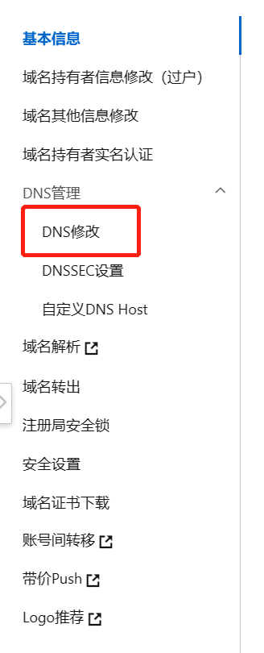
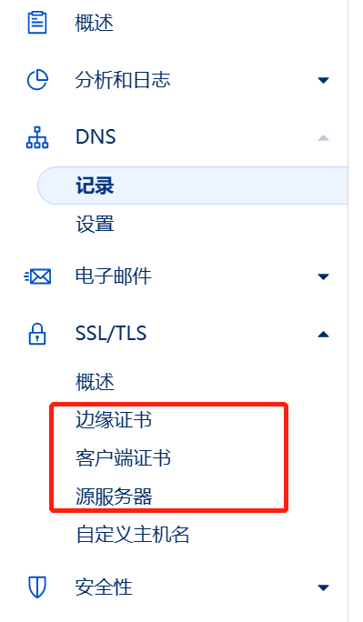
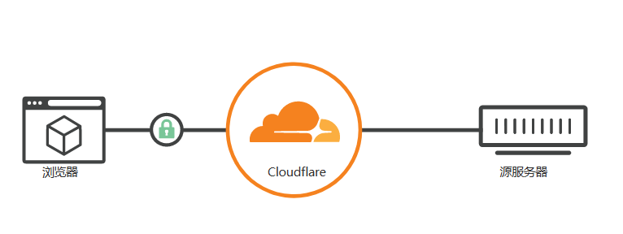

# CloudFlare 代理 FastAPI 隐藏真实 IP

这东西真是有很多坑啊~

::: warning
CloudFlare 免费版不支持四级域名(sub4.sub3.example.com)
:::

国内没备案的域名不可以使用 80 和 443 端口, 因此我把 fastapi 开在了 8011 端口, 但是 CF 不支持代理 8011 端口. 👉[CloudFlare 支持的端口](https://developers.cloudflare.com/fundamentals/get-started/reference/network-ports/)

可以看到 CF 除了 80, 443 端口还支持一些其他端口的代理, 本文使用 `8443` 端口

## 修改域名的名称服务器

在 CF [控制台](https://dash.cloudflare.com/)添加站点, 然后 CF 会让我们在域名提供商处把 DNS 设置为 CF 提供的名称服务器

我的域名提供商是阿里云, 所以进入阿里云控制台修改 DNS:



然后就成功把在 CF 控制台激活了我们的域名(全球 DNS 同步一般需要 48-72 小时, 所以我去睡了一觉)

## 申请 SSL 证书

在 CF 控制台点击一个域名进入仪表盘, 可以在侧栏看到 SSL/TLS 下有很多种证书:


CF 代理模式大致如下:



可以看到浏览器的请求首先发给 CF 服务器, 然后由 CF 服务器对我们的源服务器发起请求, 最后把我们的源服务器返回的内容返回给浏览器

然后我们就看可以理解这些不同的证书是怎么用的了.^[https://machbbs.com/hostloc/486252]

1. **边缘证书**: 由受信 CA 颁布的证书, 会被浏览器认为是安全的
2. **客户端证书**: 客户端证书就是需要使用这个证书才能访问你的网站，否则 cf 会拦下
3. **源服务器证书**: cloudflare 的自签证书, 只有 cf 自己会信任, 但如果不然通过 CF 代理,直接访问域名的话, 浏览器会显示不安全.

所以我们要申请一个源服务器证书.

申请好之后会生成两个字符串. 分别是`源证书`和`私钥`, 需要把这两个保存到服务器上, 一会儿配置 nginx 开启 SSL 的时候需要.

我分别保存为`/root/cert/example.com.cert`, `/root/cert/example.com.key`. `xxx`是域名(比如: example.com)

## 配置 Nginx

这里只给出server的配置方法.

```nginx
server {
    listen 8443 ssl;
    server_name example.com;
    ssl_certificate /root/cert/exmaple.com.cert;
    ssl_certificate_key /root/cert/example.com.key;
    location / {
        proxy_pass http://localhost:8011; // [!code warning]
        proxy_set_header Host $host;
        proxy_set_header X-Real-IP $remote_addr;
        proxy_set_header X-Forwarded-For $proxy_add_x_forwarded_for;
        proxy_set_header X-Forwarded-Proto https;
    }
}
```


我的fastapi开在8011端口, 因此proxy_passs设置为`http://localhost:8011`

## 开启FastAPI

```sh
uvicorn app.main:app --host 0.0.0.0 --port 8011 --reload
```

## 结束

到这里就配置完成了. 可以通过curl测试一下:

```sh
curl https://{YOUR DOMAIN}:8443
```
