# Nuxt/Nitro 集成 Cloudflare D1 Database

## D1 Database

D1 是 Cloudflare 提供的分布式数据库，本身基于 SQLite 开发，因此很多 ORM 都可以对接（例如 [`Prisma ORM`](https://www.prisma.io/docs/orm/overview/introduction/what-is-prisma), [`drizzle`](https://orm.drizzle.team/)）。不过截止至 2025.01.02，笔者并不推荐使用 Prisma 来搭配 D1 Database，诚然 Prisma 是一个优秀的 ORM 库，但是它的 Query Engine 是用的 WASM，体积比较大，Cloudflare Worker 免费计划的单个项目的最大体积必须在 3M 以内（gzip），付费计划最大体积是10M（gzip）^[https://developers.cloudflare.com/workers/platform/limits/#worker-size]，这空间十分滴珍贵，不能浪费在这种地方（但是Prisma未来的计划就是逐步缩小 Query Engine 的体积，所以未来说不定可以考虑 Prisma），因此本文使用 drizzle。

## wrangler

[wrangler](https://www.npmjs.com/package/wrangler) 是 Cloudflare 提供的的命令行工具，提供了一个简单的接口，可以让在本地开发环境中利用 [miniflare](https://github.com/cloudflare/miniflare) 创建 Cloudflare Worker 的模拟环境。

首先你需要有一个 Cloudflare 账号，对此本文不做赘述。

### 安装

我们可以在你的项目里使用你喜爱的包管理安装 wrangler。

**pnpm**:

```sh
pnpm add -D wrangler
```

**bun**:

```sh
bun add -D wrangler
```

### 登录

在使用 wrangler 创建环境前，需要先使用这条指令来登录 cloudflare：

```sh
pnpx wrangler login
```

（为了方便起见，本文将用更加流行的 pnpm 来进行演示，如果你使用的是bun的话，只需要把下面的指令从 `pnpx` 换成 `bunx` 即可）

这条指令会自动用浏览器打开一个标签页，需要你登录cloudflare账号，然后授权登录本地的wrangler。

### 创建 D1 Database

登陆完 wrangler 之后可以用命令行来创建 D1 数据库了，我们用这条指令可以创建一个名为 Test 的数据库：

```sh
pnpx wrangler d1 create Test
```

会看到如下输出：

```sh
 ⛅️ wrangler 3.99.0
-------------------

✅ Successfully created DB 'Test' in region WNAM
Created your new D1 database.

[[d1_databases]]
binding = "DB"
database_name = "Test"
database_id = "a33752ea-32ed-4f44-80a3-71cf2cf55522"
```

把 `[[d1_databases]]` 及以后的文本给复制下来，在项目根目录创建一个名为 `wrangler.toml` 的文件，把刚才复制的内容粘贴进去, 然后在该文件的开头加上关于项目的一些配置, 例如：

```toml
name="cf-nitro"
pages_build_output_dir="dist"
```

其中 name 是项目名称，pages_build_output_dir 是编译结果的输出文件夹。最终效果如图：

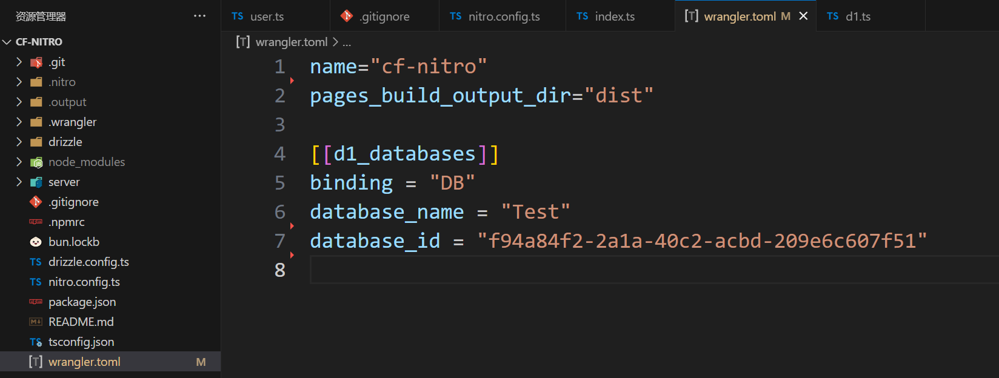

`wrangler.toml` 是 Cloudflare Worker 的配置文件，虽然现在已经有了 [JSON 格式](https://github.com/cloudflare/workers-sdk/issues/2376)，但是 toml 格式更加稳定些。

此时我们登录网页端的 Cloudflare Dashboard，进入 `D1 SQL` 页面：

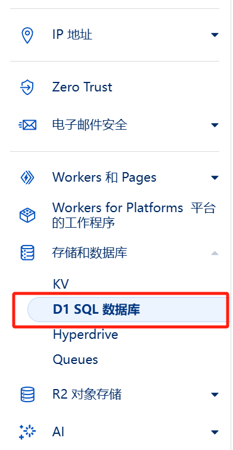

会看到多出来了一个数据库，名为 Test：

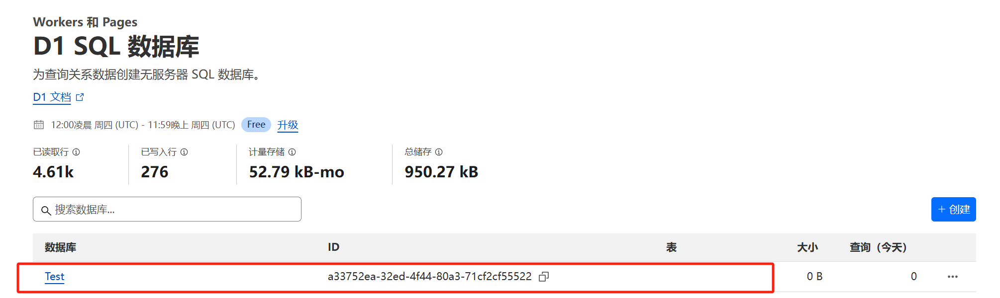

也可以在命令行里使用 `pnpx wrangler d1 list` 来查看已有的数据库：

```sh
> pnpx wrangler d1 list

 ⛅️ wrangler 3.99.0
-------------------

┌──────────┬────────┬──────────────┬────────────┬────────────┬───────────┐
│ uuid     │ name   │ created_at   │ version    │ num_tables │ file_size │
├──────────┼────────┼──────────────┼────────────┼────────────┼───────────┤
│ a3375... │ Test   │ 2025-01-...  │ production │            │           │
├──────────┼────────┼──────────────┼────────────┼────────────┼───────────┤
```

至此，我们的数据库已经创建好了，接下来我们要用 ORM 库来创建一个演示用的表。

## drizzle

[drizzle](https://orm.drizzle.team/docs/get-started/d1-new) 是一个基于 TypeScript 的 ORM 库，很早就支持 D1 了，因此也比较成熟易用。

首先安装依赖：

```sh
pnpm add -D drizzle-orm drizzle-kit
```

CLoudflare Worker 的运行时并不是是 NodeJS，而是他们自研的 [workerd](https://github.com/cloudflare/workerd)，为了兼容大部分的 NodeAPI，我们要往 `wrangler.toml` 里写入：

```toml
compatibility_flags = [ "nodejs_compat" ]
compatibility_date = "2025-01-02"
```

+ `compatibility_flags` 设置为 `["nodejs_compat"]` 意味着在我们的项目中同时启用了 workerd 内建的 API 和 NodeJS 的 polyfills。
+ `compatibility_date` 设置为 `"2025-01-02"`，表示我们确保我们的项目兼容截止到2025年1月2日的 Cloudflare Worker 运行时。


### Schema

我们一直说 drizzle 是一个 ORM 库，这意味着他的所有操作（增删改查，创建数据库等）都是基于 Schema 来完成的。

我们在项目中创建一个 `db/schema/user.ts`, 定义一张User表，写入如下代码：

```ts
import { int, sqliteTable, text } from "drizzle-orm/sqlite-core";

export const usersTable = sqliteTable("users_table", {
  id: int().primaryKey({ autoIncrement: true }),
  name: text().notNull(),
  age: int().notNull(),
  email: text().notNull().unique(),
});
```

如图：

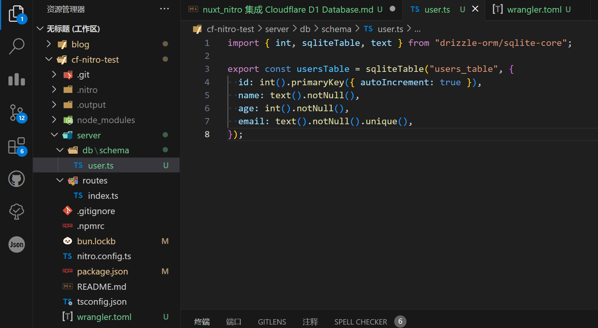

### drizzle.config.ts

现在我们有了 schema，就可以使用 drizzle-kit 来生成 SQL 语句了，但是在此之前，我们还需要创建一个 `drizzle.config.ts`，来告诉 `drizzle-kit` schema 的位置，以及生成的 SQL 语句应该放置在哪里：

```ts
import { defineConfig } from 'drizzle-kit';

export default defineConfig({
  out: './drizzle', // SQL 的输出路径
  schema: './server/db/schema', // schema 的位置
  dialect: 'sqlite', // 正如我们上文所说，D1 是基于 SQLite 的
});
```

如图：

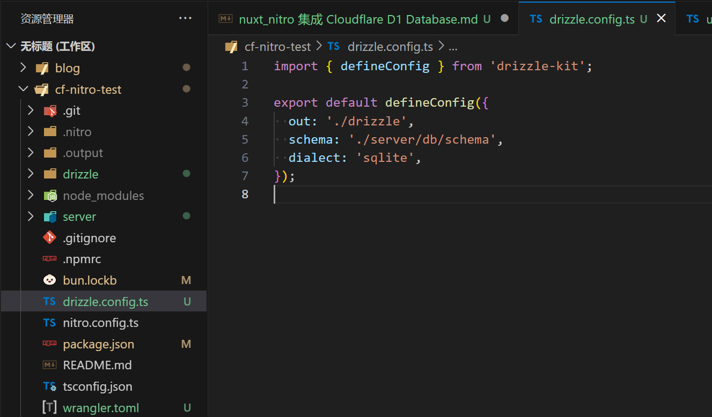

### 生成 SQL

现在我们有了 schema，也有了 drizzle.config.ts，可以用 drizzle-kit 生成 SQL 语句了，使用如下命令:

```sh
pnpx drizzle-kit generate
```

可以看到如下输出：

```sh
> pnpx drizzle-kit generate
No config path provided, using default 'drizzle.config.ts'
Reading config file '...\drizzle.config.ts'
1 tables
users_table 4 columns 1 indexes 0 fks

[✓] Your SQL migration file ➜ drizzle\0000_worthless_ravenous.sql 🚀
```

然后我们会发现自己的项目目录下多了一个名为 `drizzle` 的文件夹，里面有一个名为 `0000_worthless_ravenous.sql` 的文件，这就是我们的 drizzle 生成的 SQL 语句了。当然你的文件名可能不是 `0000_worthless_ravenous.sql`，这是 drizzle 使用随机的单词生成的，无所谓文件名，只要不重复就行了。

## 迁移数据库

现在我们有了 SQL 语句，也登陆好了 wrangler，接下来我们就可以用 wrangler 把这些 SQL 语句应用到 D1 数据库上了。

不过为了让 wrangler 知道我们生成的 SQL 文件的路径，我们还需要往 `wrangler.toml` 里添加一行：

```toml
migrations_dir = "drizzle"
```

如图:

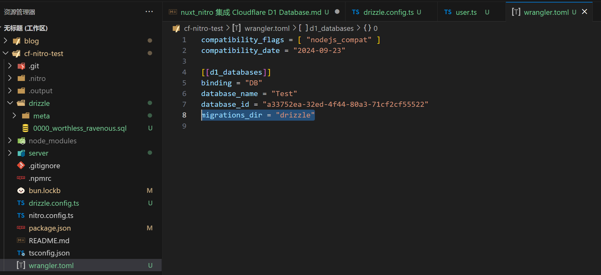

然后我们就可以愉快地用 wrangler 进行数据库迁移了(这条指令中的Test就是我们刚才创建的 Test 数据库，如果的你数据库使用了其他名字，需要自行替换)：

```sh
pnpx wrangler d1 migrations apply Test --local
```

使用这条指令后会看到如下输出：

```sh
 ⛅️ wrangler 3.99.0
-------------------

Migrations to be applied:
┌─────────────────────────────┐
│ name                        │
├─────────────────────────────┤
│ 0000_worthless_ravenous.sql │
└─────────────────────────────┘
? About to apply 1 migration(s)
Your database may not be available to serve requests during the migration, continue? » (Y/n)
```

我们回车即可：

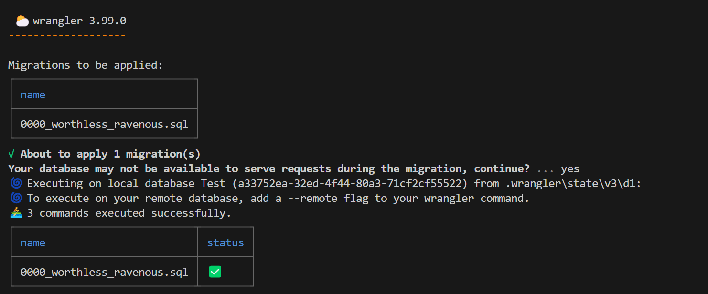

等这条指令执行完，不出意外的话，我们的项目里会多出一个 `.wrangler` 文件夹，这就是用于存放 miniflare 数据的路径。

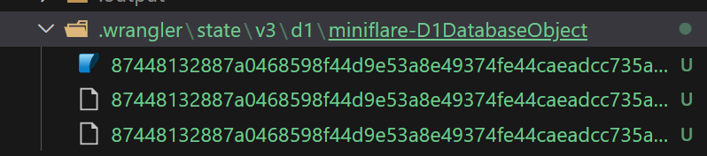

至此，我们的 SQL 语句已经成功应用到我们**本地**的 D1 数据库上了，用 SQLite 工具预览数据库，可以看到如下结果:

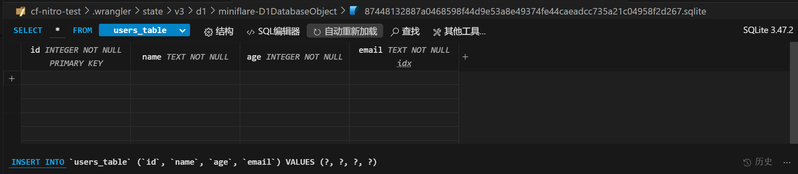

## 在 Nuxt/Nitro 中使用 D1 Database

在上文中，我们已经创建完了一个名为 Test 的 D1 数据库，接下来可以在我们的 Nuxt/Nitro 项目中使用了。

(由于 Nuxt 是基于 Nitro 和 Vue 的一个前端框架，因此本文介绍的方法同样可以在 Nuxt 框架中使用。)


然后我们安装 [`nitro-cloudflare-dev`](https://github.com/nitrojs/nitro-cloudflare-dev)，这是 nitro 的一个 module, 允许在 nitro 的 dev Server 中使用 wrangler 和 miniflare 暴露的 [getPlatformProxy API](https://github.com/cloudflare/workers-sdk/pull/5002) 来访问 Cloudflare runtime platform:

```sh
pnpm add -D nitro-cloudflare-dev
```

`nitro-cloudflare-dev` 会查找最近的 `wrangler.toml`，并自动往 nitro 中注入正确的环境变量，非常方便。


### 对于 Nuxt

只需要更新 `nuxt.config.ts`，加入如下代码即可：

```ts
export default defineNuxtConfig({
  modules: ["nitro-cloudflare-dev"],
});
```

### 对于 Nitro

对于 Nitro 更新 `nitro.config.ts`：

```ts
import nitroCloudflareBindings from "nitro-cloudflare-dev";

export default defineNitroConfig({
  modules: [nitroCloudflareBindings],
});
```

### 定义中间件使用 D1

中间件是大部分后端框架都有的功能，[nitro 也不例外](https://nitro.build/guide/routing#middleware)。你使用的是 Nuxt，可以参考[官方文档](https://nuxt.com/docs/guide/directory-structure/server#server-middleware) 来了解中间件。

本文基于 nitro 进行介绍，如果你使用的是 nuxt，那么唯一的区别就是中间件的路径不同，代码是一样的，如果你不了解中间件的话，无论如何都请先看一下官方教程！

首先我们创建一个 `server/middleware/d1.ts` 的文件，里面写入如下代码：

```ts
import { drizzle, DrizzleD1Database } from 'drizzle-orm/d1'
import * as schema from '~/db/schema/user'

declare module 'h3' {
	interface H3EventContext {
		db: DrizzleD1Database<typeof schema>
	}
}

let cloudflare

export default defineEventHandler(async ({ context }) => {
	cloudflare = context.cloudflare || cloudflare
	// 这里之所以是 DB 是因为我们在 `wrangler.toml` 里把 binding 设置为了 "DB"
	const { DB } = (context.cloudflare || cloudflare).env
	context.db = drizzle(DB, { schema: { ...schema } })
})
```

如图：

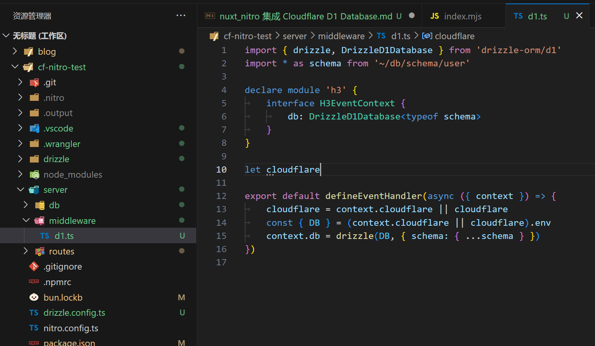

由于在经过任意一个路由的时候都会先经过中间件，所以每个路由的context里都会有一个名为db的属性，这便是我们的 DrizzleD1Database 对象。

例如，我们可以在 `server/routes/index.ts` 中写入如下代码：

```ts
import { eq } from "drizzle-orm";
import { usersTable } from "~/db/schema/user";

export default eventHandler(async (event) => {
  const zhangsan = (await event.context.db.select().from(usersTable).where(eq(usersTable.name, "zhangsan"))).at(0)
  if(zhangsan) {
    return zhangsan
  }
  const res = await event.context.db.insert(usersTable).values({
    name: "zhangsan",
    age: 18,
    email: "zhangsan@outlook.com"
  })
  return {
    ok: true
  }
});
```

如图：

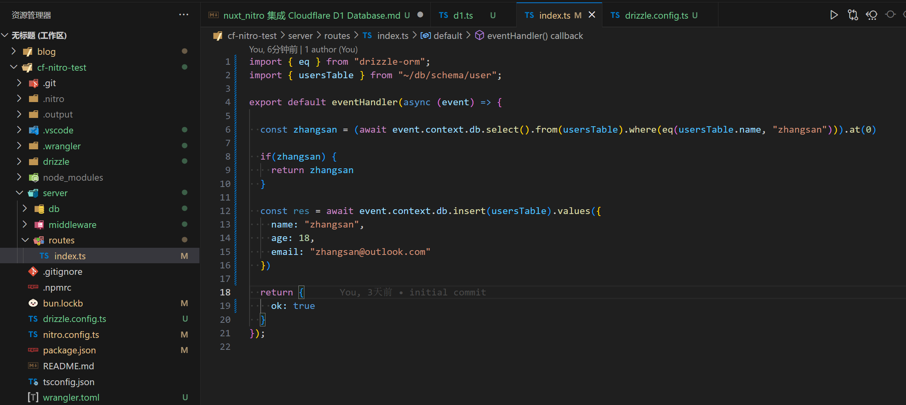


然后启动我们的项目：

```sh
pnpm dev
```

第一次打开的时候会往数据库里写入数据, 第二次打开的时候就会从数据库里取出数据并返回。

## 部署

### 迁移到分布式数据库

刚才我们仅仅把 SQL 应用到了本地环境里，那么现在我们要把 SQL 迁移到正经的线上环境里，可以使用这条指令:

```sh
pnpx wrangler d1 migrations apply Test --remote
```

### 部署

以上便是使用 Cloudflare Worker + D1 Database 开发的全部流程，如果你一切就绪，就差部署到 Cloudflare，那么只要把这个项目上传到 GitHub，然后进入 Cloudflare 的 Dashboard，点击创建 Worker，再点击连接到 git，最后选择你的项目所在的仓库即可：

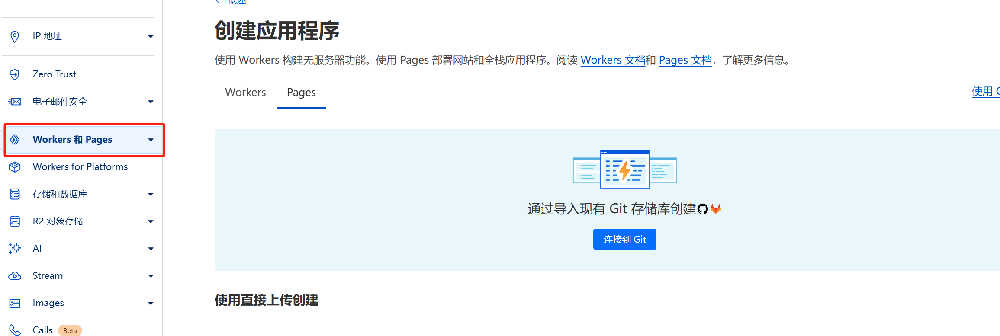

如果你把 `wrangler.toml` 放在你的项目根目录下，那么 Cloudflare 是会自动把数据库注入到你的项目里，如果你想手动注入的话，可以在 `Workers & Pages` -> 选择一个项目 -> `设置` -> `绑定`，然后选择 `D1 Database`，输入**绑定名称**，并且选择你的数据库即可：

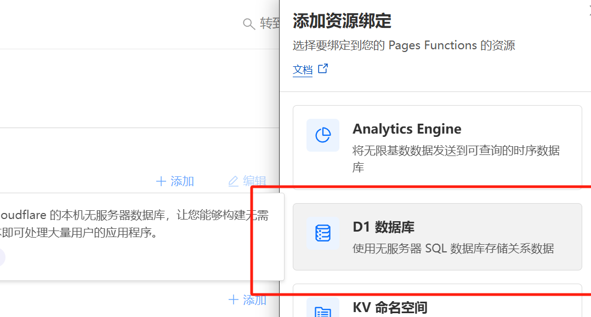

如果你的绑定名称输入的不是 `DB` 的话，还需要修改一下你的中间件，可以参考我在上文的 `d1.ts` 中写的注释。
