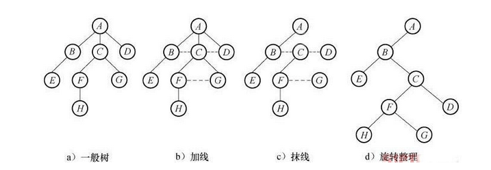
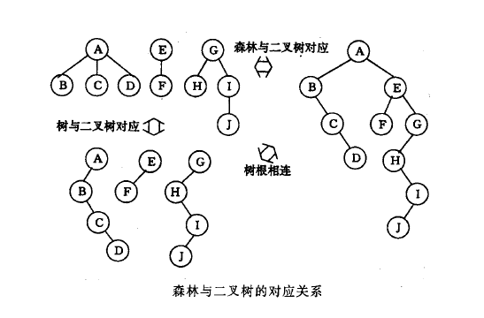
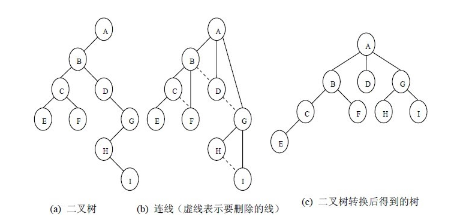
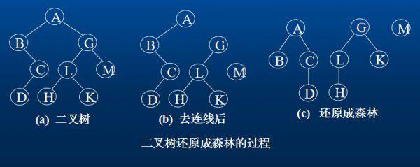

周志光老师划分的范围 qwq,
本来不紧张的，划完就紧张了...

<!--more-->

## 线性表-顺序存储

> 零个或多个数据元素的有限序列

### 特征

1．集合元素是有限个
2．除最后一个元素之外，均有唯一的后继(后件)。
3．除第一个元素之外，均有唯一的前驱(前件)。

### 基本操作

InitList(*L) 初始化操作，建立一个空的线性表
IsListEmpty(L) 判断线性表是否为空，若为空，返回 true，否则 false
ClearList(*L) 清空线性表
GetElem(L, i, *e) 将线性表 L 中的第 i 个位置的元素返回给 e
LocateElem(L, e) 在线性表 L 中查找与给定值 e 相等的元素，如果查找成功，返回该元素在表中序号表示成功；否则，返回 0 表示失败。
ListInsert(*L, i, e) 在线性表 L 中的第 i 个位置插入新元素 e
ListDelete(*L, i, *e) 删除线性表 L 中第 i 个位置元素，并用 e 返回其值
ListLength(L) 返回线性表 L 的长度，即元素个数.

### 结构体定义

```cpp
typedef int ElemType;
typedef struct
{
	ElemType data[MAXSIZE];
	int length;
}SqList;
```

数组 data 的存储位置
线性表的最大存储容量
线性表的当前长度

### 优缺点

**优点：**
无须为表示表中元素的逻辑关系而额外增加存储空间；
可以快速地存取任一位置的元素。

**缺点：**
插入和删除需要移动大量元素；
当线性表长度变化较大时，难以确定存储空间的容量；
造成存储空间的碎片。

## 线性表-链式存储

> 为了表示每个数据元素 ai 与其直接后继元素 ai+1 之间的逻辑关系，对于数据元素 ai 来说，除了存储其本身的信息之外，还需存储一个指示其直接后继的信息（即直接后继 ai+1 的存储位置）。我们把存储数据元素信息的空间称为数据域；把存储后继位置的空间称为指针域。指针域中存储的信息称为指针或链。这两部分信息组成数据元素的存储映像，称为结点（Node）。

### 头指针和头节点

**头指针：**
链表中第一个结点的存储位置叫做头指针

头指针是指向链表第一个结点的指针，若链表有头结点，则是指向头结点的指针；
头指针具有标识作用，所以常用头指针冠以链表的名字；
无论链表是否为空，头指针不为空，头指针是链表的必要元素。

**头结点：**
为了更方便对链表的操作，会在单链表的第一个结点之前增加一个结点，称为头结点。

头结点是为了操作的统一和方便而设立的，放在第一个元素之前，其数据域一般无意义；
有了头结点，在对第一个结点前插入结点和删除第一个结点，其操作和其他结点的操作就统一了；
头结点不一定是链表的必要元素。

### 结构体

```cpp
typedef struct Node
{
	ElemType data;
	struct Node* next;
}Node;

typedef struct Node* LinkList;
```

## 单链表与顺序存储的对比

**存储分配方式：**
顺序存储结构用一段连续的存储空间依次存储线性表的数据元素；
单链表采用链式存储结构，用一组任意的存储单元存放线性表的元素；

**时间性能：**

-   **查找**
    顺序存储结构 O(1)
    单链表 O(n)
-   **插入和删除**
    顺序存储结构需要平均移动表长一半的元素，时间复杂度为 O(n)
    单链表在获得某位置的指针后，插入和删除的时间仅为 O(1)

**空间性能：**

1. 顺序存储结构需要预分配存储空间，分大了，浪费，分小了，不够用；
2. 单链表不需要分配存储空间，只要内存空间有，就可以分配，元素的个数更是不受限制

## 静态链表

**用数组来代替指针：**
数组的每一个下标都对应一个 data 和 cur；
data 中存放数据；
cur 存放该元素的后继元素的下标；
线性表链式存储结构的游标实现法

### 结构体

```cpp
typedef struct
{
	ElemType data;
	int cur;
}Component, StaticLinkList[MAXSIZE];
```

### 细节

第一个元素的 cur 存放备用链表第一个结点的下标；
最后一个元素的 cur 存放当前链表第一个有数值元素的下标；

## 循环链表

将单链表中终端结点的指针由空指针改为指向头结点，就使整个单链表形成一个环，这种头尾相连的单链表称为单循环链表，简称循环链表

## 双向链表

在单链表的每个结点中，再设置一个指向其前驱结点的指针。

### 结构体

```cpp
typedef struct DulNode
{
	ElemType data;
	struct DulNode* prior;
	struct DulNode* next;
}DulNode,*DulLinkList;
```

## 线性表-作业

**线性表的基本操作：**
插入，删除，查找，…
线性表的复杂操作
并集，交集，…

**PAT 题目集合：**
两个有序链表序列的合并
两个有序链表序列的交集
一元多项式的乘法与加法运算
打印选课学生名单
一元多项式求导
Reversing Linked List

## 栈

栈（Stack）是限定仅在表尾进行插入和删除操作的**线性表**。

-   栈是线性表，即栈的元素具有线性关系，即前驱后继关系
-   线性表可以在表中任何位置进行插入、删除操作
-   栈只能在表尾进行插入、删除操作
-   表尾称为栈顶

**插入操作：**
进栈、压栈、入栈

**删除操作：**
出栈、弹栈

**应用：**

递归
四则运算表达式求值

### 顺序栈

同线性表，元素具有相同的类型，相邻元素具有前驱和后继关系。

#### 结构体

```cpp
typedef struct
{
	ElemType data[MAXSIZE];
	int top;
}SqStack;
```

#### 优缺点

**优点：**
后进先出规则的实现；
插入、删除尤其方便；

**缺点：**
栈的大小是固定的；

### 链栈

#### 结构体

```cpp
typedef struct StackNode
{
	ElemType data;
	struct StackNode* next;
}StackNode, *LinkStackPtr;

typedef struct LinkStack
{
	LinkStackPtr top;
	int count;
}LinkStack;
```

### 基本操作

**InitStack ( \*S )**：初始化操作.建立一个空栈 S。
**DestroyStack ( \*S )**：若栈存在，則销毁它。
**ClearStack (\*S)**：将栈清空。
**StackEmpty ( S )**:若栈为空，返回 true,否則返回 false。
**GetTop (S,\*e)**：若栈存在且非空，用 e 返回 S 的栈顶元素。
**Push (\*S,e)**：若栈 S 存在，插入新元素 e 到栈 S 中并成为栈頂元素。
**Pop (*S,*e)**：删除栈 S 中栈顶元素，并用 e 返回其值。
**StackLength (S)**：返回回栈 S 的元素个数。

## 队列

队列（Queue）是只允许在一端进行插入操作，而在另一端进行删除操作的线性表。

队列是一种先进先出（First In First Out）的线性表，简称 FIFO。
允许插入的一端称为**队尾**；
允许删除的一端称为**队头**。

### 基本操作

**InitQueue(\*Q)**：初始化操作，建立一个空队列 Q；
**DestroyQueue(\*Q)**：若队列 Q 存在，則销毀它；
**ClearQueue(\*Q)**：将队列 Q 清空；
**QueueEmpty(Q)**：若队列 Q 为空，则 true，否則 false；
**GetHead(Q, \*e)**：若队列 Q 存在且非空，用 e 返因队列 Q 的队头元素；
**EnQueue(\*Q,e)**：若队列 Q 存在，插入新元素 e 到队列 Q 中并成为队尾元素；
**DeQueue(*Q, *e)**：刪除队列 Q 中队头，并用 e 返回其值；
**QueueLength(Q)**：送回队列 Q 的元素个数。

### 缺点

1. 出队的时候，队列中所有元素都要向前移动一个位置，复杂度为 O(n)；

2. 队列的大小是固定的；

### 循环队列

循环队列解决**假溢出问题**

#### 结构体

```cpp
typedef struct
{
	ElymType data[MAXSIZE];
	int front;
	int rear;
}SqQueque;
```

头尾相接的顺序存储结构—循环队列
rear==front 时，队空
rear+1== front，队满

**队空判断**：
rear==front
**队满判断：**
（rear+1）%QueueSize==front
**队长判断：**
(rear-front+QueueSize)%QueueSize

### 链式队列

队列的链式存储结构，其实就是线性表的单链表，只不过它只能尾进头出而已，我们把它称为链队列。

#### 结构体

```cpp
typedef struct QNode
{
	ElymType data;
	struct QNode* next;
}QNode, *QueuePtr;

typedef struct
{
	QueuePtr front;
	QueuePtr rear;
}LinkQueue;
```

## 栈与队列 作业

**栈：**
顺序栈基本操作
链栈基本操作
四则混合运算（基于栈的实现）

**队列：**
顺序队列基本操作
链队列基本操作
迷宫问题

## 串

串（string）是由零个或多个字符组成的有限序列，又名字符串。

串中的元素仅由一个字符组成，相邻元素具有前驱和后继关系.

### 顺序存储

```cpp
typedef struct mystring{
    char str[MaxStrSize];
    int length;
}MyString;
```

### 链式存储

```cpp
typedef struct node{
    char data;
    struct node *next;
}LinkStrNode;
typedef LinkStrNode * LinkString;
```

### 基本操作

**StrAssign (&T, chars)**：初始条件 chars 是字符串常量；操作结果生成一个其值等于 chars 的串 T；
**StrCopy (&T, S)**：初始条件串 S 存在；操作结果由串 S 复制得串 T；
**StrEmpty(S)**：初始条件串 S 存在；操作结果若 S 为空串，则返回 TRUE，否则返回 FALSE；
**StrCompare(S, T)**：初始条件串 S 和 T 存在；操作结果若 S>T，则返回值>0；若 S=T，则返回值＝ 0；若 S < T，则返回值 < 0；
**StrLength(S)**：初始条件串 S 存在；操作结果返回 S 的元素个数，称为串的长度。

## 树

树（Tree）是 n 个结点的有限集合，n=0 是空树。在任意一棵非空树中：

### 特征

-   有且仅有一个特定的称为根的结点；
-   其余结点可分为 m 个互不相交的有限集；
-   每个有限集本身又是一棵树，并且称为根的子树。

### 概念

**结点的度：**
结点所拥有子树的数目

**叶子结点：**
度为 0 的结点

**分支结点或非终端结点：**
根结点
内部结点

**树的度：**
树中各个结点的度的最大值

**孩子结点：**
结点的子树的根称为孩子结点

**双亲结点：**
该结点称为孩子结点的双亲结点

**兄弟结点：**
同一个双亲的孩子之间互称兄弟结点

**祖先结点：**
从根结点到该结点所经分支上的所有结点

**子孙结点：**
以该结点为根的子树中，任意一个结点就是该结点的子孙结点

**树的层次：**
树根为第 1 层，根的孩子为第 2 层

**树的深度：**
树中结点最大层数为树的深度或高度

**有序树：**
各个子树是从左到右，不能互换的

**森林：**
m 棵互不相交的树的集合

### ADT (抽象数据类型)

**Data：**
具有相同数据类型，具有层次关系的数据

**Operation：**
**InitTree(&T)**; //构造空树 T。
**DestroyTree(&T)**;//销毁树 T。
**CreateTree(&T,definition)**;//构造树 T
**ClearTree(&T)**; //将树 T 清为空树。
**TreeEmpty(T)**; //若 T 为空树，则返回 TRUE;
**TreeDepth(T)**; //返回Ｔ的深度。
**Root(T);**//返回 T 的根。

### 基本操作

**Value(T,cur_e)**;//返回 cur_e 的值。  
**Assign(T,cur_e,value)**; //结点 cur_e 赋值为 value。
**Parent(T,cur_e)**; //若 cur_e 是 T 的非根结点，则返回它的双亲;
**LeftChild(T,cur_e)**; //返回最左孩子;
**RightSibling(T,cur_e);** //返回它的右兄弟;
**InsertChild(&T,&p,i,c)**; //插入 c 为Ｔ中ｐ指结点的第ｉ棵子树。
**DeleteChild(&T,&p,i)**; //删除Ｔ中ｐ所指结点的第ｉ棵子树。
**TraverseTree(T)** //按某种次序对 T 的每个结点遍历

### 双亲表示法-结构体

```cpp
typedef struct //节点结构
{
    TElemType data;
	int parent; //双亲位置域
}PTNode;
typedef struct //树结构
{
    PTNode node[MAX_TREE_SIZE];
    int r, n; //根的位置和节点个数
}PTree;
```

### 孩子表示法

每个结点有多个指针域
每个指针指向一棵子树的根结点
多重链表表示法

### 结构体

```cpp
typedef struct CTNode      //孩子结点链
{
    int child;
    struct CTNode *next;
} *ChildPtr;

typedef struct CTBox      //孩子结点链
{
   char data;
   ChildPtr firstchild;
}CTBox;

typedef struct            //树状结构
{
    CTBox nodes[MAX_TREE_SIZE];
    int r, n;
} CTree ;
```

### 孩子双亲表示法

```cpp
typedef struct CTNode     //孩子结点链
{
    int child;
    struct CTNode *next;
} *ChildPtr;

typedef struct CTBox      //孩子结点链
{
    char data;
    int  parent;
    ChildPtr firstchild;
}CTBox;

typedef struct            //树状结构
{
    CTBox nodes[MAX_TREE_SIZE];
    int r, n;
} CTree ;
```

### 孩子兄弟表示法

```cpp
typedef struct Node
{
    DataType element;
    struct Node * pFirstChild;
    struct Node * pNextSibling;
}*Tree;
```

### 二叉树

二叉树（Binary Tree）是 n 个结点的有限集合，该集合或者为空集，或者由一个根结点和两个互不相交的、分别称为根结点的左子树和右子树的二叉树组成。

### 特征

1. 每个结点最多有两棵子树
2. 左子树和右子树是有顺序的
3. 即使某结点只有一棵子树，也要区分它是左子树还是右子树

### 形态

-   空二叉树
-   只有一个根结点
-   根结点只有左子树
-   根结点只有右子树
-   根结点既有左子树又有右子树

### 特殊二叉树

**斜树：**
所有结点都只有左子树的二叉树称为左斜树；
所有结点都只有右子树的二叉树称为右斜树；

**满二叉树：**
所有结点都存在左子树和右子树，并且所有叶子结点都在同一层上。
叶子结点只能位于最下层
非叶结点的度一定是 2
同样深度的二叉树中，满二叉树的结点最多

**完全二叉树：**
对于一棵有 n 个结点的二叉树按程序标号，如果编号为 i 的结点与同样深度的满二叉树编号为 i 的结点在二叉树中的位置完全相同。
叶子结点只能出现于最下两层
最下层的叶子结点一定连续位置
导数第二层，若有叶子结点，一定都在右布连续位置
如果结点度为 1，则该结点只能有左孩子
同样结点数的二叉树，完全二叉树的深度最小

### 性质

二叉树的第 **i** 层之多有 **2<sup>(i-1) </sup>**个结点；

深度为 **k** 的二叉树至多有 **2<sup>k</sup>-1** 个结点；

任何一棵二叉树 T，如果其终端结点的个数为 n0，度为 2 的结点数为 n2，则 n0=n2+1；

具有 **n** 个结点的完全二叉树深度为 **int(log<sub>2</sub>n)+1**；

如果对一棵有 n 个结点的完全二叉树的结点按层序编号，对任意一个结点 i，有：

-   如果 i=1，则结点 i 是二叉树的根；
-   如果 i>1，则其双亲结点 int(i/2);
-   如果 2i>n，则结点 i 无左孩子；
-   如果 2i+1>n，则结点 i 无右孩子；

### 二叉树顺序存储-作业

**课后作业：**
定义二叉树顺序存储结构
创建、清空二叉树
求二叉树的深度
求二叉树结点的个数
求任何一个结点的左孩子，右孩子结点
求任何一个结点的双亲结点

### 二叉链表

二叉树每个结点最多有两个孩子，可以为二叉树结点设置 1 个数据域和 2 个指针域

#### 结构体

```cpp
typedef struct Node{  
    ElemType data;
    struct Node *lchild;
    struct Node *rchild;  
}BiTNode, *BiTree; 
```

### 二叉树遍历

1. **前序遍历**

    先遍历根结点
    依次前序遍历左子树和右子树

2. **中序遍历**

    从根结点开始
    中序遍历左子树
    访问根结点
    中序遍历右子树

3. **后序遍历**

    从根结点开始
    后序遍历左子树
    后序遍历右子树
    访问根结点

4. **层序遍历**

### 线索二叉树

Threaded Binary Tree

-   空指针废物利用，分别指向当前结点的前驱结点和后继结点；
-   变废为宝的空指针称为线索；
-   加上线索的二叉树称为线索二叉树。

### 结构体

```cpp
typedef char ElemType; //数据类型
typedef enum {Link,Thread} PointerTag;
//Link==0表示左、右孩子结点，Thread==1表示指向前驱或后继的线索

typedef struct BiThrNode
{
      ElemType data;
      struct BiThrNode* lchild,* rchild;
      PointerTag ltag;
      PointerTag rtag;
} BiThrNode,*BiThrTree;
```

## 森林，树，二叉树！

### 树转换成二叉树

**STEP1. 加线：**

所有兄弟结点之间加一条线；

**STEP2. 去线：**

对于树中每个结点，只保留其与第一个孩子结点的连线，删除其与其它孩子结点之间的连线；

**STEP3. 层次调整：**

以树的根结点为轴心，讲整个树顺时针旋转一定角度，使之层次分明。



<center style="font-size:12px">树转换为二叉树</center>

### 森林转二叉树



1. 把每棵树转换为二叉树；
2. 第一棵二叉树不动，从第二棵二叉树开始，依次把后一棵二叉树的根结点作为前一棵树叶子节点的右孩子；

### 二叉树转树

> 加线，去线，层次调整



### 二叉树转森林

从根结点开始，若右孩子存在，则删除连接右孩子的线；
将得到的一系列二叉树转换为树；



### 树的遍历

**先根遍历：**
首先访问树的根结点，然后依次先根遍历根的每棵子树；

**后根遍历：**
依次后根遍历每棵子树，然后再访问根结点；

## 哈夫曼编码

> **前缀编码：**
>
> 即较短的编码不能是任何较长的编码的前缀，这样解析的时候才不会混淆

把要编码的字符放在二叉树的叶子上，所有的左节点是 0，右节点是 1，从根浏览到叶子上，因为字符只能出现在树叶上，任何一个字符的路径都不会是另一字符路径的前缀路径，符合前缀原则编码就可以得到。

构造更优的二叉树，原则就是权重越大的叶子，距离根应该越近，而我们的终级目标是生成“最优”的二叉树，最优二叉树必须符合下面两个条件：

1. 所有上层节点都大于等于下层节点。
2. 某节点，设其较大的子节点为ｍ，较小的子节点为ｎ，ｍ下的任一层的所有节点都应大于等于ｎ下的该层的所有节点。

### 构造哈夫曼树

1. 从各个节点中找出最小的两个节点，给它们建一个父节点，值为这两个节点之和。
2. 从节点序列中去除这两个节点，加入它们的父节点到序列中。
3. 重复上面两个步骤，直到节点序列中只剩下唯一一个节点。这时一棵最优二叉树就已经建成了，它的根就是剩下的这个节点。

### 结构体

```cpp
// 哈夫曼树节点
typedef struct HuffNode{
    int weight;
    char ch;
    string code;
    struct HuffNode *rchild;
    struct HuffNode *lchild;
}HuffMan;

// 哈夫曼队列
typedef struct Node{
    HuffMan *data;
    struct Node *next;
}ListNode;

typedef struct{
    ListNode *front;
    ListNode *rear;
}Queue;
```

## 树-作业

二叉树的建立
二叉树的遍历
二叉树 ADT 基本操作
二叉树线索化
线索二叉树的遍历
哈夫曼编码

## 图

是由顶点的有穷非空集合和顶点之间边的集合组成，通常表示为：G（V，E）。其中，G 表示一个图，V 是图 G 中顶点的集合，E 是图 G 中边的集合

**各种类型：**

-   无向图
-   有向图
-   简单图
-   无向完全图
-   有向完全图
-   稀疏图
-   稠密图
-   带权图

### 概念

**路径：**
树中根结点到任何一个结点的路径

**环：**
第一个顶点和最后一个顶点相同的路径

**简单路径：**
顶点不重复出现的路径

**简单环：**
除第一个和最后一个顶点外，其余顶点不重复出现的回路

**连通图：**

-   无向图中，如果从顶点 u 到顶点 v 有路径，则称 u 和 v 是联通的
-   如果图中任意两个顶点 u 和 v 都是连通的，则称该图为连通图

**连通分量：**

无向图的极大连通子图称为**连通分量**( Connected Component)

**强连通图：**
有向图中，对于每一对顶点 u 和 v，都存在由 u 到 v 和由 v 到 u 的路径，则称该图为强连通图。

**强连通分量：**
有向图中的极大强连通子图称为有向图的强连通分量。

**生成树：**

一个连通图的生成树是一个极小连通子图，它含有图中全部的 n 个顶点，但只有足以构成一棵树的 n-1 条边。

### 邻接矩阵

图的邻接矩阵存储方式是用两个数组来表示图。一个一维数组存储图中顶点信息，一个二维数组（成为邻接矩阵）存储图中边的信息。

#### 结构体

```cpp
typedef struct
{
        VertexType vexs[MAXVEX];
        EdgeType arc[MAXVEX][MAXVEX];
        int numVertexes,numEdges;
}MGraph;
```

### 邻接表

-   图中顶点用一个一维数组存储；
-   图中每个顶点 v 的所有邻接点构成一个线性表。

#### 结构体

```cpp
typedef struct EdgeNode
{
	int adjvex; //邻接点
	EdgeWeight weight; //权值
	struct EdgeNode* next; //指向下一条边
}EdgeNode;

typedef string VertexType; //顶点类型

typedef struct
{
	VertexType data;
	EdgeNode* pFirstEdge; //指示第一条边
}VertexNode;

typedef VertexNode AdjList[MAXVEX];//邻接表

typedef struct
{
	AdjList adjList; //邻接表
	int iVexNum; //顶点个数
	int iEdgeNum; //边数
}AdjListGraph;
```

### 最小生成树

构造连通网的最小代价生成树成为最小生成树

使用不同的遍历图的方法，可以得到不同的生成树；从不同的顶点出发，也可能得到不同的生成树。
按照生成树的定义，n 个顶点的连通网络的生成树有 n 个顶点、n-1 条边。

**构造最小生成树的准则：**

1. 用且仅用 n-1 条边来联结 n 个顶点；
2. 不能使用产生回路的边；
3. 各边上的权值的总和达到最小。

#### 克鲁斯卡尔 (Kruskal) 算法

**基本思想：**
设有一个有 n 个顶点的连通网络 N={V,E}, 最初先构造一个只有 n 个顶点,没有边的非连通图 T={V,$\varnothing$}, 图中每个顶点自成一个连通分量。当在 E 中选到一条具有最小权值的边时, 若该边的两个顶点落在不同的连通分量上，则将此边加入到 T 中; 否则将此边舍去，重新选择一条权值最小的边。如此重复下去, 直到所有顶点在同一个连通分量上为止。

#### 普里姆(Prim)算法

**基本思想：**

1. 从连通网络 N={V,E}中的某一顶点 u0 出发,选择与它关联的具有最小权值的边 (u0,v),将其顶点加入到生成树顶点集合 U 中。
2. 以后每一步从一个顶点在 U 中,而另一个顶点不在 U 中的各条边中选择权值最小的边(u,v),把顶点 v 加入到集合 U 中。如此继续下去,直到网络中的所有顶点都加入到生成树顶点集合 U 中为止。

### 最短路径

对于网图来说，最短路径是指两顶点之间经过的边上权值之和最少的路径，并且我们称路径上的第一个顶点是源点，最后一个顶点是终点。

#### 单源最短路径

给定一个带权有向图 G=(V,E)，其中每条边的权是一个非负实数。另外，还给定 V 中的一个顶点，称为源。现在我们要计算从源到所有其他各顶点的最短路径长度。这里的长度是指路上各边权之和。这个问题通常称为单源最短路径问题。

#### Dijkstra 算法

1. 按路径长度的递增次序,逐步产生顶点 v 到其它各顶点的最短路径。
2. 即首先求出长度最短的一条最短路径，再参照它求出长度次短的一条最短路径，依次类推，直到从顶点 v 到其它各顶点的最短路径全部求出为止。

### 图-作业

**图的存储结构：**

-   邻接矩阵
-   邻接表

**图的遍历：**

-   深度优先遍历
-   广度优先历

**图的算法：**

-   最小生成树（Prim，Kruskal）
-   单源最短路径

### 图-自学内容

**存储结构：**

-   十字链表
-   邻接多重表

**单源最短路径：**

-   Floyd 算法

**拓扑排序**

**关键路径**


<!-- 还没更新的 内容 -->
<!--
队列

循环队列

对空堆满的条件

算法复杂度（排序算法）
计算方法，为什么要算

栈

树，
重点：二叉树

比如给后续遍历，写中序遍历

各种遍历结果


平衡二叉树


二叉树编程

算法设计，创建二叉树


数据结构的概念、

数据结构，算法，程序之间的关系


dj斯特拉算法复杂度，优缺点，

写最小生成树

某一种排序的第一次划分结果

编程题：

二叉树一系列问题（遍历...之类的）
单链表（插入删除，创建）
栈，队列
图（遍历....）
最短路径
最小生成树，


原理题目:

哈夫曼编码，哈夫曼树，排序（归并，快排，堆排序）

平衡二叉树看PPT，重点，课上讲的少
-->
