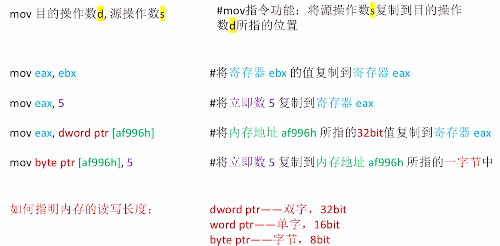
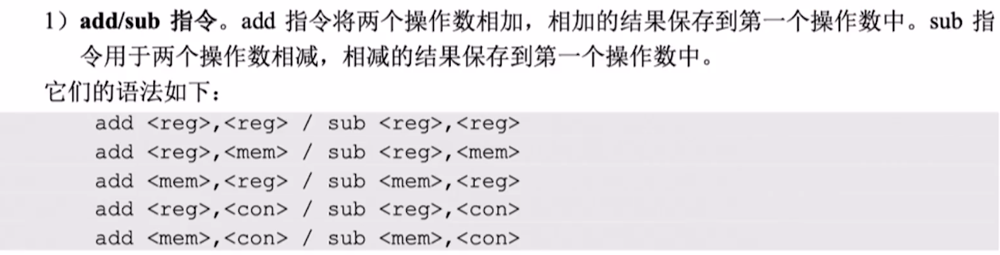
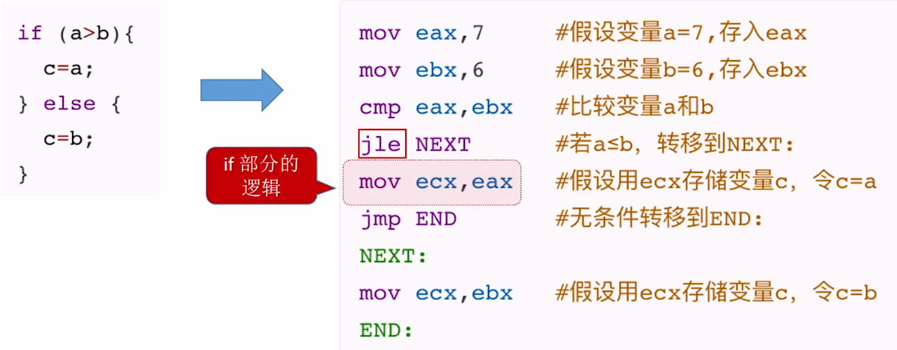

# x86 汇编基础


eg: mov


## 寄存器


- AX, BX, CX, ...: 通用寄存器的 E 去掉的话, 意思是使用该寄存器的低十六位.
- AH, BH, CH, ...: 表示使用 AX, BX, CX, ...的高 8 位
- AL, BL, CL, ...: 表示使用 AX, BX, CX, ...的低 8 位


## 各种寻址方式


## 常用汇编指令

**x86 汇编语言中两个操作数不可以都来自主存, 不然访存次数太多了, 执行会很慢**

### 常见算术运算指令




### 常见逻辑运算指令


### AT&T 格式

- AT&T: Unix/Linux 常用格式(贝尔实验室发明)
- Intel: Windows 常用


如此看来还是 Intel 格式比较简洁, 符合笔者的口味().

### if-else



### 循环


**loop:**


## 函数调用

x86 系统中, 默认以 4 字节作为栈的操作单位.

`EBP`堆栈基指针, 指向当前栈帧的"底部(高地址)",

`ESP`堆栈顶指针, 指向当前栈帧的"顶部(低地址)"

- `call`: 把 IP 压栈, 然后无条件转移至被调用函数的第一条指令.
- `ret`: IP 旧值出栈, 无条件转移至旧值.
- `Push <val>`: ESP-4, 再把`<val>`压入
- `Pop <Addr>`: 栈顶元素写入`<Addr>`, 再让 ESP+4

### 切换栈帧

进入函数时:

```asm
push ebp
mov ebp, esp
```

等价于:

```asm
enter
```

退出函数时:

```asm
mov esp, ebp
pop ebp
```

等价于:

```
leave
```

~~妙啊~~


## CISC 和 RISC


